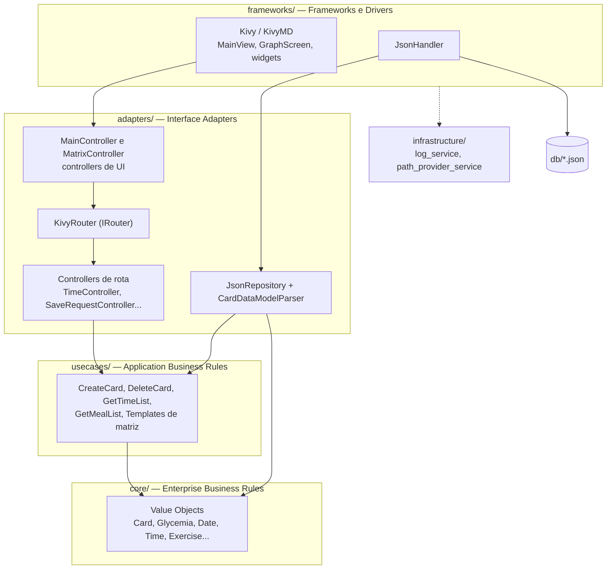

# Dextros 🩸


**Dextros** é um aplicativo desktop/mobile para registro e acompanhamento de dados de controle glicêmico de pacientes diabéticos — um diário glicêmico digital, inspirado nas cartelas de papel que endocrinologistas costumam pedir para os pacientes preencherem manualmente.

> O nome vem de "dextro", como é popularmente chamado no Brasil o teste de glicemia capilar.

Construído em **Python + Kivy/KivyMD**, seguindo princípios de **Clean Architecture**, para rodar tanto em desktop (Windows/Linux/macOS) quanto em Android a partir da mesma base de código.

---

## 📦 Release

**[V0.1 — Primeira versão de Dextros!](https://github.com/babingoia/Dextros/releases/tag/V0.1)** *(pre-release)*

Aplicativo que salva registros de glicemia com data, horário, quantidade de insulina, observações, refeição e exercícios realizados, e os mostra de forma estilizada em dois gráficos diferentes.

📱 [Baixar o APK para Android](https://github.com/babingoia/Dextros/releases/download/V0.1/dextros.apk)

---

## ✨ Funcionalidades

- 📋 **Registro de medições (Cards)**: glicemia, insulina de ação longa (basal) e de ação rápida (bolus), exercício físico (com intensidade no domínio), período da refeição associado e observações livres (até 240 caracteres).
- 📊 **Visualização em matriz "Dia × Hora"**: todas as medições do dia organizadas por horário, em uma grade rolável construída com `RecycleView`.
- 🍽️ **Visualização em matriz "Dia × Refeição"**: acompanhamento da glicemia em relação aos períodos de refeição (jejum, pré/pós almoço, pré/pós jantar, madrugada etc.).
- 🔍 **Zoom por pinça e duplo toque** nas matrizes (0.7× a 2.0×), com persistência do nível de zoom por tela durante a sessão.
- 📌 **Cabeçalhos fixos (sticky headers)**: modo opcional que congla as linhas de datas e colunas de hora/refeição enquanto o corpo da matriz rola.
- 🗑️ **Exclusão de registros com confirmação**: popup de detalhes → diálogo de confirmação → exclusão e recarregamento da matriz.
- 🌓 **Interface responsiva**: navbar lateral retrátil em telas pequenas, navbar fixa e formulário em duas colunas em telas largas.
- 💾 **Persistência local em JSON**, com escrita atômica (arquivo temporário + `replace`) — segura contra corrupção de dados em caso de falha no meio da escrita.
- 🧾 **Diálogos padronizados** (`AppDialog`/`ConfirmDialog`/`ErrorDialog`) com feedback de salvamento e exibição de erros na própria UI.

---

## 🏗️ Arquitetura

O projeto segue uma variação de **Clean Architecture / Ports & Adapters**, organizada em camadas concêntricas onde as dependências sempre apontam para dentro (`frameworks → adapters → usecases → core`):



| Camada | Responsabilidade |
|---|---|
| `core/` | Value Objects imutáveis (`@dataclass(frozen=True)`) e regras de negócio puras (ex: `Card`, `Glycemia`, `Date`). Não depende de nenhuma outra camada. |
| `usecases/` | Casos de uso da aplicação (ex: `CreateCardUseCase`, geração de matrizes via **Template Method**). Depende apenas de portas (`ICardRepository`, `ICardCreator`). |
| `adapters/` | Controllers de rota (padrão Command), roteador (`IRouter`/`KivyRouter`), parsers e o repositório concreto (`JsonRepository`) — traduzem dados entre o mundo externo e os casos de uso. |
| `frameworks/` | Detalhes concretos de framework: UI em Kivy/KivyMD (controllers de UI, widgets, decorators de zoom/sticky) e persistência em arquivo JSON. |
| `infrastructure/` | Utilitários transversais: logging colorido e resolução de paths multiplataforma (dev / PyInstaller / Android). |

📖 Para uma análise técnica completa e aprofundada (todos os módulos classe a classe, fluxos ponta a ponta, testes e dívidas técnicas conhecidas), veja **[documentação.md](./documentação.md)**.

---

## 🚀 Como executar

### Opção 1: Instalar o APK (Android)

Baixe o `.apk` diretamente da [página do release V0.1](https://github.com/babingoia/Dextros/releases/tag/V0.1) e instale no seu dispositivo Android (pode ser necessário habilitar "instalar de fontes desconhecidas" nas configurações do sistema, já que o app ainda não está em nenhuma loja de aplicativos).

### Opção 2: Rodar a partir do código-fonte (desktop)

#### Pré-requisitos

- **Python 3.10 ou superior** (o código usa `match/case` e type hints `X | Y`)

#### Instalação

```bash
# 1. Clone o repositório
git clone https://github.com/babingoia/Dextros.git
cd Dextros

# 2. Crie e ative um ambiente virtual (recomendado)
python -m venv .venv
source .venv/bin/activate        # Linux/macOS
# .venv\Scripts\activate         # Windows

# 3. Instale as dependências (requirements.txt com versões fixadas)
pip install -r requirements.txt
```

> As dependências principais são `kivy==2.3.1`, `kivymd==1.2.0`, `pytest==9.1.1`, `hypothesis==6.165.10` e `colorama==0.4.6`. O `requirements.txt` também inclui ferramentas de empacotamento (`buildozer` para o APK Android e `pyinstaller` para executáveis de desktop).

#### Executando o app

```bash
python main.py
```

Na primeira execução, o app cria automaticamente o diretório de dados do usuário e copia um banco de dados de exemplo (`db/cards_populated.json`, com ~1000 registros fictícios) para lá, além de criar a pasta `logs/`.

#### Empacotamento

| Destino | Ferramenta |
|---|---|
| Executável desktop (.exe/.app) | `pyinstaller` (incluído no `requirements.txt`) |
| APK Android | `buildozer` (incluído no `requirements.txt`) |

---

## 📁 Estrutura do projeto

```
Dextros/
├── main.py               # Composition Root — monta e injeta todas as dependências
├── core/                 # Value Objects e regras de negócio (Card, Glycemia, Date, ...)
├── usecases/             # Casos de uso (criar/deletar card, gerar matrizes), DTOs e factories
├── adapters/             # Controllers de rota, roteador, parsers, repositório JSON
├── frameworks/           # UI (Kivy/KivyMD: widgets, decorators, diálogos) e handler JSON
├── infrastructure/       # Logging colorido e resolução de paths (dev/PyInstaller/Android)
├── db/                   # Bancos de dados JSON (seed e exemplos)
└── tests/                # Testes unitários e de integração (pytest + hypothesis)
```

---

## 🧪 Testes

O projeto conta com **279 itens de teste** (220 funções `test_*`, expandidas por parametrização e testes baseados em propriedade) entre unitários e de integração:

| Suíte | Escopo |
|---|---|
| `tests/unit/core/` | Todos os Value Objects do domínio, incluindo testes baseados em propriedade (`hypothesis`) para `Glycemia` |
| `tests/unit/usecases/` | Orquestração de `CreateCard`/`DeleteCard` (mocks, fakes e hypothesis) |
| `tests/unit/usecases/Matrix/` | Templates de matriz `BaseColumnMatrixTemplate`, `Base1D`, `Base2D` (50 testes) |
| `tests/unit/adapters/` | `CardDataModelParser` e `JsonRepository` (com mocks) |
| `tests/unit/frameworks/` | `JsonHandler` (escrita atômica, retrocompatibilidade) |
| `tests/integration/` | `JsonRepository` com `JsonHandler` **real** em disco: CRUD, JSON corrompido, caracteres especiais/emoji, consistência |

Última execução registrada: **275 passando, 1 pulado (caso parametrizado), 3 falhando** — as falhas são testes que esperam `DuplicatedCellError` sendo *lançado*, enquanto a implementação atual apenas *loga* o erro (detalhes na [documentação.md](./documentação.md#17-dívidas-técnicas-e-problemas-identificados)).

```bash
pytest
```

---

## 🗺️ Roadmap

Alguns dos próximos passos planejados (veja [`Planejamento.md`](./Planejamento.md) para a lista completa):

- [ ] Calculadora de insulina rápida (bolus) a partir da glicemia e carboidratos consumidos.
- [ ] Configuração de thresholds de glicemia/insulina, refletidos visualmente nas matrizes.
- [ ] Gráfico de linha com média de glicemia por horário ao longo de X dias.
- [ ] Campo de carboidratos nas refeições.
- [ ] Edição de registros já salvos (o repositório já possui `update_card`).
- [ ] Import/export do banco de dados.
- [ ] Testes end-to-end e de UI.

---

## 🩺 Base clínica

Os valores padrão de referência para hipoglicemia e hiperglicemia usados pelo domínio (`Glycemia`) foram definidos com base na diretriz oficial da Sociedade Brasileira de Diabetes: [diretriz.diabetes.org.br/metas-no-tratamento-do-diabetes](https://diretriz.diabetes.org.br/metas-no-tratamento-do-diabetes/).

Os níveis de intensidade de exercício (`leve`, `moderada`, `vigorosa`) seguem o Guia de Atividade Física para a População Brasileira.

> Este aplicativo é uma ferramenta de **registro pessoal** e não substitui orientação médica. Consulte sempre um profissional de saúde para decisões de tratamento.

---

## 📄 Licença

Distribuído sob a **PolyForm Noncommercial License 1.0.0**. Veja [`LICENSE`](./LICENSE) para o texto completo.

Em resumo (isso não substitui a leitura da licença): você pode usar, estudar, modificar e distribuir este código livremente para **qualquer finalidade não-comercial** — uso pessoal, estudo, projetos hobby, organizações educacionais, de pesquisa, de saúde pública ou sem fins lucrativos. **Uso comercial não é permitido** sob esta licença.

---

## 🤝 Contribuindo

Contribuições são bem-vindas! O projeto segue algumas convenções de nomenclatura específicas (arquivos em `snake_case`, classes em `PascalCase`, sufixo `Controller`/`Service` obrigatório nas respectivas camadas, `parse()` como ponto de entrada dos Value Objects) — confira [`documentação.md`](./documentação.md) antes de abrir um PR.
