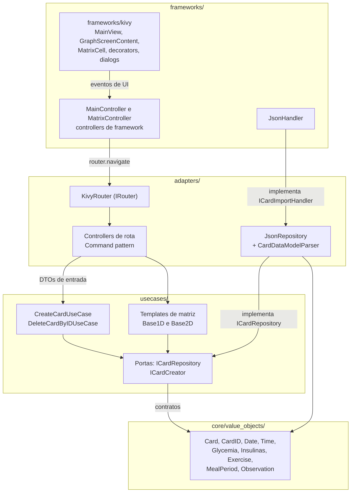
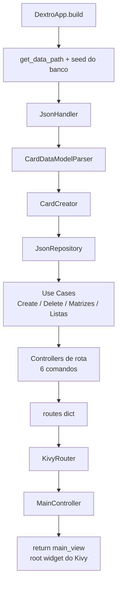
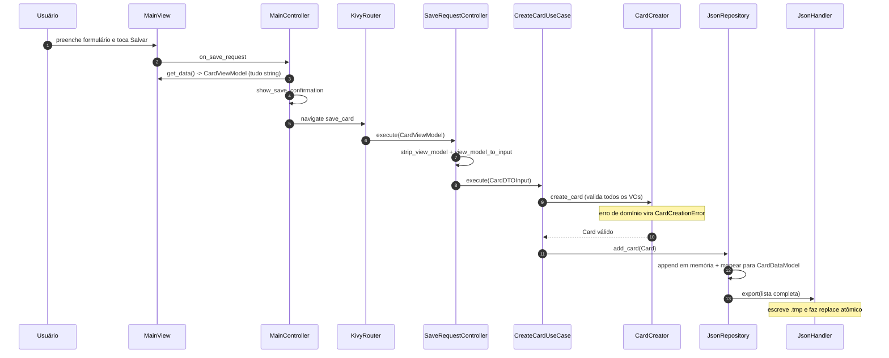
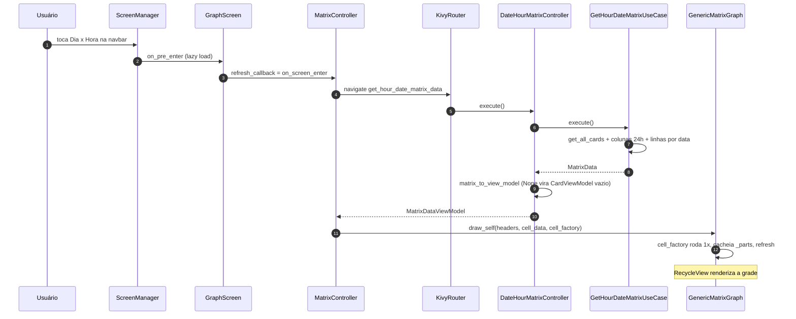
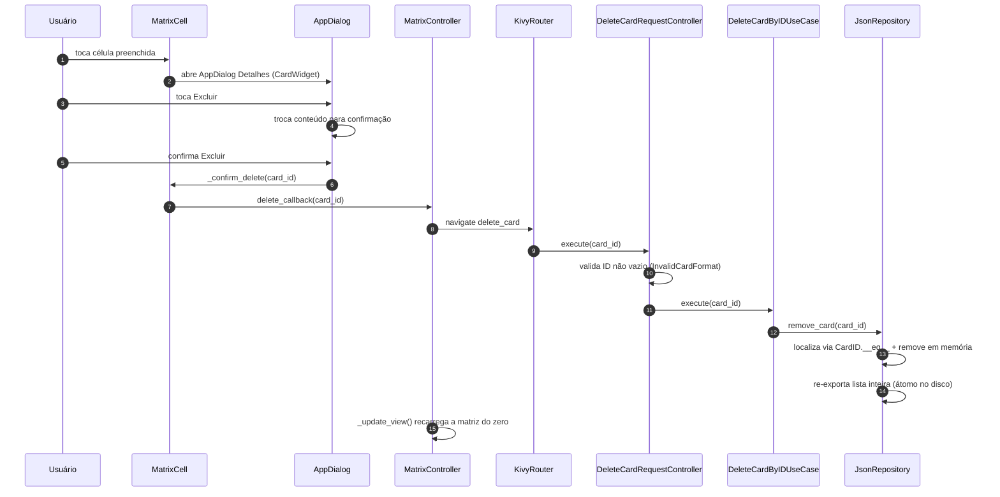
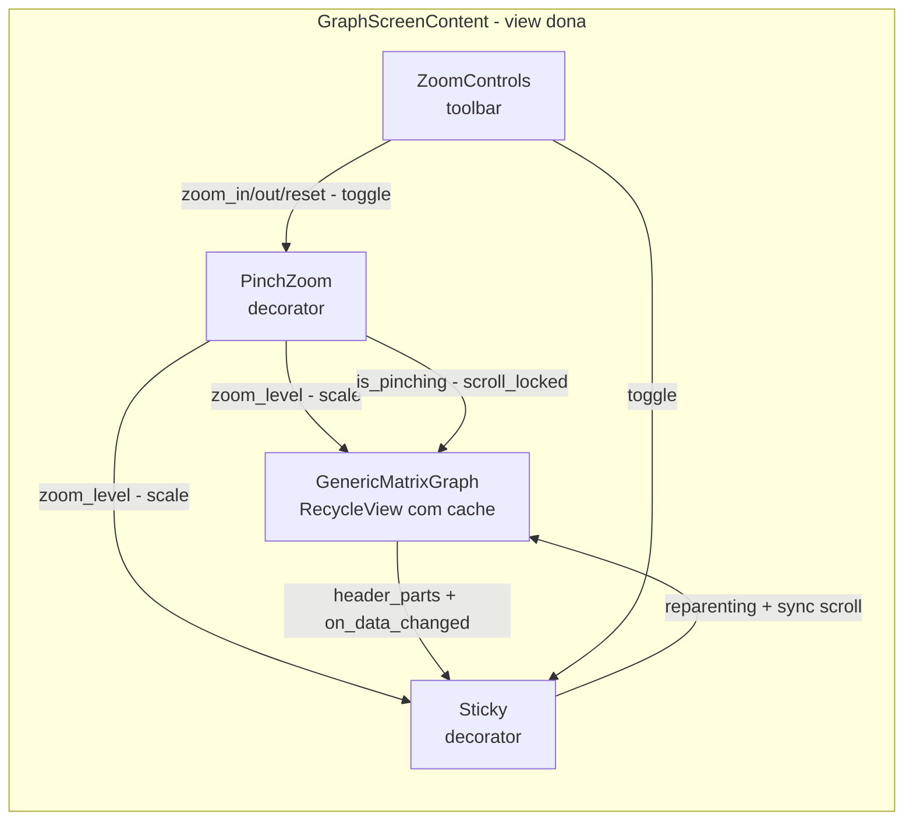

# Documentação Técnica — Dextros

> Documentação de engenharia produzida a partir da leitura integral do código-fonte do repositório [`babingoia/Dextros`](https://github.com/babingoia/Dextros) (branch `main`) e da **execução real da suíte de testes**. Cobre arquitetura, domínio, casos de uso, adapters, frameworks, interface gráfica, testes, persistência de dados, convenções e dívidas técnicas identificadas no próprio código.
>
> **Estado analisado**: commit mais recente da branch `main` ("Criação de requirements.txt"), setembro/2026. Esta versão substitui a documentação anterior de 30/08/2026 — os itens resolvidos desde então (criação do `requirements.txt`, correção do import quebrado nos testes, refatoração da camada de UI com zoom/sticky/diálogos) foram incorporados e as estatísticas recalculadas.

---

## Sumário

1. [Visão Geral](#1-visão-geral)
2. [Stack Tecnológica e Dependências](#2-stack-tecnológica-e-dependências)
3. [Arquitetura Geral](#3-arquitetura-geral)
4. [Estrutura de Diretórios](#4-estrutura-de-diretórios)
5. [Camada Core (Domínio)](#5-camada-core-domínio)
6. [Camada Use Cases](#6-camada-use-cases)
7. [Camada Adapters](#7-camada-adapters)
8. [Camada Frameworks](#8-camada-frameworks)
9. [Camada Infrastructure](#9-camada-infrastructure)
10. [Persistência de Dados (JSON)](#10-persistência-de-dados-json)
11. [Composition Root (`main.py`)](#11-composition-root-mainpy)
12. [Fluxos de Execução Ponta a Ponta](#12-fluxos-de-execução-ponta-a-ponta)
13. [Interface Gráfica (Kivy/KivyMD)](#13-interface-gráfica-kivykivymd)
14. [Testes](#14-testes)
15. [Convenções de Código do Projeto](#15-convenções-de-código-do-projeto)
16. [Roadmap Declarado pelo Autor](#16-roadmap-declarado-pelo-autor)
17. [Dívidas Técnicas e Problemas Identificados](#17-dívidas-técnicas-e-problemas-identificados)
18. [Como Executar o Projeto](#18-como-executar-o-projeto)
19. [Licença](#19-licença)

---

## 1. Visão Geral

**Dextros** é um aplicativo desktop/mobile (via Kivy/KivyMD) para **registro e acompanhamento de dados de controle glicêmico de pacientes diabéticos**. O nome vem de "dextro" (teste de glicemia capilar, popularmente chamado assim no Brasil). O aplicativo digitaliza a cartela de papel que endocrinologistas costumam pedir para os pacientes preencherem manualmente, transformando-a em uma grade interativa, filtrável por horário ou por período de refeição, com recursos modernos de usabilidade como zoom por gestos, cabeçalhos fixos e diálogos de confirmação.

Cada registro (chamado de **Card**) armazena, para um dado momento:

- Data e hora do teste (com arredondamento de domínio para a hora cheia mais próxima);
- Valor de glicemia (mg/dL), com thresholds clínicos de hipo/hiperglicemia configuráveis;
- Dose de insulina de ação longa/ultralonga (basal);
- Dose de insulina de ação rápida/ultrarrápida (bolus);
- Exercício físico realizado (nome + intensidade: `leve`, `moderada` ou `vigorosa`);
- Período da refeição associado ao registro (11 valores fechados: jejum, pré/pós almoço etc.);
- Uma observação textual livre (até 240 caracteres).

A aplicação permite visualizar esses registros em **matrizes (grades) bidimensionais** — "Dia × Hora" e "Dia × Refeição" — funcionando como um diário glicêmico tabular. Há também um caso de uso unidimensional (`GetAverageGlycemiaPerDayUseCase`, média de glicemia por dia) pronto para alimentar futuros gráficos de linha previstos no roadmap.

Os thresholds de hipo/hiperglicemia usados como referência de domínio foram baseados na diretriz da Sociedade Brasileira de Diabetes (citada em `Planejamento.md`: https://diretriz.diabetes.org.br/metas-no-tratamento-do-diabetes/).

O projeto está em **desenvolvimento ativo**. Desde a última documentação (30/08/2026), o repositório recebeu: a criação do `requirements.txt` com versões fixadas, uma expressiva expansão da suíte de testes (de 143 para 279 itens coletados, incluindo uma suíte dedicada aos templates de matriz), e uma **refatoração substancial da camada de UI** — o gráfico de matriz agora é propriedade de um componente de conteúdo (`GraphScreenContent`) que compõe decorators de **zoom por pinça** (`PinchZoom`) e **cabeçalhos fixos** (`Sticky`), além de um sistema padronizado de diálogos (`AppDialog` e derivados) que permite exibir erros e confirmações diretamente na interface.

---

## 2. Stack Tecnológica e Dependências

O repositório agora possui um **`requirements.txt` com versões fixadas** (último commit da branch `main`), resolvendo a lacuna de reprodutibilidade apontada na documentação anterior. O manifesto inclui tanto as dependências de runtime/teste quanto as de empacotamento (desktop e Android).

| Pacote | Versão fixada | Uso no projeto |
|---|---|---|
| **Python** | ≥ 3.10 (requisito de linguagem) | Linguagem principal. Uso extensivo de recursos modernos: `dataclass(frozen=True)`, `match/case` (structural pattern matching, Python ≥ 3.10), union types `X \| Y` (PEP 604), `InitVar`, `TypedDict`. |
| **Kivy** | 2.3.1 | Framework de UI multiplataforma (desktop + mobile). Usado para `RecycleView`, `ScreenManager`, `ModalView`, propriedades reativas (`Properties`), eventos de toque na `Window`, linguagem declarativa `.kv` e `Factory`. |
| **KivyMD** | 1.2.0 | Camada de componentes Material Design sobre o Kivy. A aplicação (`DextroApp`) herda de `kivymd.app.MDApp`; o seletor de datas usa `kivymd.uix.pickers.MDDatePicker`. |
| **pytest** | 9.1.1 | Framework de testes unitários e de integração (incluindo parametrização e `tmp_path`). |
| **hypothesis** | 6.165.10 | Testes baseados em propriedades (property-based testing) — usado em `Glycemia`, `Card`, `CreateCardUseCase`, `DeleteCardByIDUseCase` e nos templates de matriz. |
| **colorama** | 0.4.6 | Colorização de saída de log no console (import opcional/protegido por `try/except` em `log_service.py`). |
| **buildozer** | 1.6.0 | Empacotamento do APK Android (python-for-android). |
| **pyinstaller** | 6.20.0 | Empacotamento de executáveis de desktop (.exe/.app). |
| Cython, meson, ninja, pillow, sh etc. | fixadas | Dependências transitivas/ferramentas de build (Cython 0.29.37 é o pino compatível com o buildozer/Kivy 2.3.1). |
| `json`, `uuid`, `datetime`, `pathlib`, `logging`, `dataclasses`, `abc`, `typing`, `shutil` | stdlib | Biblioteca padrão do Python, usada extensivamente no core, na persistência e na infraestrutura. |

**Observações de tipagem de versão**: o `requirements.txt` foi criado com pinos exatos (`==`), o que torna o ambiente totalmente reproduzível via `pip install -r requirements.txt`. Não há ainda um `pyproject.toml`/`setup.py` (o projeto não é instalável como pacote Python — roda a partir da raiz do repositório).

### Persistência

Não há banco de dados relacional ou NoSQL — a persistência é feita em **arquivos JSON simples** no disco, através de um `JsonHandler` com escrita atômica (ver seção 10).

---

## 3. Arquitetura Geral

O projeto segue uma variação de **Clean Architecture / Arquitetura Hexagonal (Ports & Adapters)**, com quatro camadas macro nomeadas explicitamente nos diretórios de topo do repositório:

```
core            → Regras de negócio puras (Enterprise Business Rules)
usecases        → Casos de uso da aplicação (Application Business Rules)
adapters        → Adaptadores entre usecases e o mundo externo (Interface Adapters)
frameworks      → Detalhes de framework/infraestrutura concreta (Frameworks & Drivers)
infrastructure  → Utilitários transversais (logging, paths)
```

A regra de dependência do Clean Architecture é respeitada: **as setas de importação sempre apontam para dentro** (`frameworks → adapters → usecases → core`), e o `core` nunca importa nada das camadas externas. O único ponto do sistema onde implementações concretas são instanciadas e conectadas às interfaces é o Composition Root (`main.py` — seção 11).



### 3.1 Presentation (conceito declarado pelo autor)

A "Presentation" é dividida por tecnologia (hoje só Kivy, mas pensada para comportar outra tecnologia de UI no futuro, ex: web):

- **UI**: visualização pura — widgets, propriedades e eventos (arquivos `.py` + `.kv` em `frameworks/kivy/ui`). Na refatoração recente, esse princípio se fortaleceu: `GraphScreenContent` é a view **dona** do gráfico, do zoom e do sticky — o controller apenas injeta dados em `content.graph` e não conhece nenhum decorator.
- **Controllers** (de framework, em `frameworks/kivy/controllers`): atuam como *mediators* entre a UI concreta (Kivy) e o mundo externo, traduzindo eventos de UI em chamadas ao roteador (`IRouter`), mantendo baixo acoplamento.

Isso é conceitualmente diferente dos **Controllers em `adapters/controllers`**, que são os *Interface Adapters* do Clean Architecture — eles não sabem nada sobre Kivy, apenas recebem DTOs e chamam Use Cases.

### 3.2 Infrastructure

Guarda ferramental transversal e utilitário (logging, resolução de paths multiplataforma). É consumida por qualquer camada, mas nunca depende delas — é "reativa" aos domínios que a usam.

### 3.3 Core

Contém apenas:

- **Value Objects** (`core/value_objects`) — a única coisa que existe hoje no core;
- Validação de regras de negócio;
- Tipagem específica de domínio;
- Nenhuma dependência de nenhuma outra camada (nem de `usecases`, nem de frameworks externos como Kivy).

### 3.4 Padrão de fronteira: `parse()` como único ponto de entrada

Um padrão consistente em **todos** os Value Objects do `core`: o construtor "cru" do `dataclass` é reservado (documentado nas docstrings como "Método reservado. Usar parse para criar entidades como entry point"), e toda a lógica de coerção de tipos (`str → int`, `None`, *trimming*, normalização de caixa) vive em um `classmethod parse()`, que despacha para construtores privados (`_from_string`, `_from_int`, `_new`, etc.) usando `match/case` sobre o tipo do valor recebido. Isso garante que:

- Objetos de domínio nunca existem em estado inválido (validação ocorre em `__post_init__`);
- A conversão de tipos "sujos" (vindos de JSON, formulários de UI) fica isolada e testável separadamente da validação pura;
- Os testes unitários podem exercitar tanto o caminho `parse()` quanto o construtor direto, verificando que os invariantes valem em ambos (padrão visível em `tests/unit/core/`).

### 3.5 Fluxo de dependência (visão macro)

Em uma frase: a UI Kivy dispara eventos → o `MainController` traduz em chamadas `router.navigate(rota, dados)` → o `KivyRouter` despacha para um `IController` → o controller converte ViewModel em DTO de caso de uso → o caso de uso orquestra `Factories` + `ICardRepository` → os Value Objects do core validam tudo → o `JsonRepository` serializa via `JsonHandler` → o JSON em disco é atualizado atomicamente. As três seções do bloco 12 detalham esse caminho passo a passo para criar, visualizar e excluir registros.

---

## 4. Estrutura de Diretórios

```
Dextros/
├── main.py                                   # Composition Root + entry point
├── README.md                                 # Descrição, setup e visão geral do projeto
├── Planejamento.md                           # Anotações e roadmap do autor
├── documentação.md                           # Este documento
├── LICENSE                                   # PolyForm Noncommercial License 1.0.0
├── requirements.txt                          # Dependências com versões fixadas (NOVO)
├── .gitignore / .gitattributes               # LF normalization, exclusões padrão
│
├── core/
│   └── value_objects/
│       ├── card.py                # Entidade agregadora (Card) + arredondamento de hora
│       ├── card_id.py             # VO de identidade (UUID v4) com __eq__ heterogêneo
│       ├── date.py                # VO de data (wrapper de datetime.date)
│       ├── time.py                # VO de hora (wrapper de datetime.time)
│       ├── glycemia.py            # VO de glicemia + thresholds clínicos validados
│       ├── long_acting_insulin.py # VO de insulina basal (0 → None)
│       ├── short_acting_insulin.py# VO de insulina bolus (0 → None)
│       ├── exercise.py            # VO de exercício físico (nome + intensidade)
│       ├── meal.py                # VO de período de refeição (11 valores fechados)
│       └── observation.py         # VO de observação textual (240 chars)
│
├── usecases/
│   ├── IRepository.py                        # Porta ICardRepository (5 métodos)
│   ├── create_card_use_case.py
│   ├── delete_card_by_id_use_case.py
│   ├── get_meal_list_use_case.py
│   ├── get_time_list_use_case.py
│   ├── Factories/
│   │   ├── I_card_creator.py                 # Porta ICardCreator
│   │   └── card_creator.py                   # Fábrica concreta de Card (valida tudo)
│   ├── dtos/
│   │   ├── cardDTOInput.py                   # Entrada de use case (InitVar p/ exercício)
│   │   ├── card_output.py                    # Saída de leitura (date/time nativos)
│   │   ├── matrix_data.py                    # Matriz 2D (dict de células)
│   │   ├── single_row_matrix_data.py         # Gráfico 1D (uma linha)
│   │   ├── meal_list.py                      # Lista de refeições válidas
│   │   └── time_output.py                    # Um único time de domínio
│   ├── get_matrix_data/
│   │   ├── base_column_matrix_template.py    # Template Method — base comum
│   │   ├── base_1d_matrix_template.py        # Template Method 1D
│   │   ├── base_2d_matrix_template.py        # Template Method 2D
│   │   ├── get_hour_date_matrix_data.py      # Matriz Data × Hora
│   │   ├── get_meal_date_matrix_data.py      # Matriz Data × Refeição
│   │   └── get_average_glycemia_day_use_case.py # Média de glicemia/dia (1D)
│   └── utils/
│       ├── exceptions.py                     # Hierarquia de exceções (+ Duplicated*)
│       └── mappers.py                        # to_card_output (Card → CardOutput)
│
├── adapters/
│   ├── exceptions.py                         # CardNotFoundError, InvalidCardFormat, RouteError
│   ├── controllers/
│   │   ├── i_controller.py                   # IController genérico (Command + Generic)
│   │   ├── time_controller.py
│   │   ├── meal_controller.py
│   │   ├── save_request_controller.py
│   │   ├── delete_card_request_controller.py
│   │   ├── date_hour_matrix_controller.py
│   │   ├── date_meal_matrix_controller.py
│   │   ├── dtos/
│   │   │   ├── card_view_model.py            # CardViewModel (TypedDict, tudo str)
│   │   │   ├── matrix_data_view_model.py
│   │   │   └── time_view_model.py            # TimeList
│   │   └── mappers/
│   │       └── mappers.py                    # strip, view_model_to_input, matrix_to_view_model...
│   ├── gateways/
│   │   ├── i_router.py                       # Porta IRouter
│   │   └── kivy_router.py                    # Dispatcher concreto de comandos
│   ├── parsers/
│   │   ├── icard_parser.py                   # Porta ICardParser (marcada como deprecável)
│   │   └── card_data_model_parser.py         # CardDataModel → CardDTOInput
│   └── repositories/
│       ├── i_import_handler.py               # Porta ICardImportHandler (load/export)
│       ├── jsonRepo.py                       # Repositório em memória + re-export total
│       └── DTOs/
│           └── card_data_model.py            # CardDataModel (TypedDict do JSON)
│
├── frameworks/
│   ├── json_handler_service.py               # JSON com escrita atômica (tmp + replace)
│   └── kivy/
│       ├── controllers/
│       │   ├── main_controller.py            # Orquestrador da tela principal
│       │   └── matrix_controller.py          # Controller de um gráfico de matriz
│       └── ui/
│           ├── app_theme.py                  # Design tokens (cores, espaçamentos, breakpoints)
│           ├── main_scene.kv                 # Layout principal (346 linhas)
│           ├── ui_components.kv              # 12 componentes reutilizáveis (243 linhas)
│           ├── main_view.py                  # View raiz (BoxLayout) + diálogos de feedback
│           └── widgets/
│               ├── Border.kv / Card.kv       # Visual do Border e do CardWidget (179 linhas)
│               ├── loader.py                 # Border e CardWidget (popup de detalhes)
│               ├── creators/card_creator.py  # Mapeia ViewModel → dict de célula Kivy
│               ├── popup/
│               │   ├── dialog.py             # AppDialog, ConfirmDialog, ErrorDialog (NOVO)
│               │   └── dialog.kv             # Casca do diálogo genérico (104 linhas)
│               ├── pickers/date_picker.py    # Wrapper do MDDatePicker
│               ├── graphs/
│               │   ├── generic_matrix_graph.py/.kv  # RecycleView genérica com cache
│               │   ├── matrix_cell.py/.kv           # Célula individual + fluxo de exclusão
│               │   ├── decorators/
│               │   │   ├── zoom_decorator.py # Zoom base + PinchZoom na Window (NOVO)
│               │   │   └── sticky_decorator.py # Cabeçalhos fixos por reparenting (NOVO)
│               │   ├── controls/
│               │   │   ├── zoom_controls.py/.kv     # Toolbar - / 100% / + / 📌 (NOVO)
│               │   └── screens/
│               │       └── graph_screen.py/.kv      # GraphScreen + GraphScreenContent (NOVO)
│
├── infrastructure/
│   ├── log_service.py                        # Logging colorido (ANSI) + arquivo
│   └── path_provider_service.py              # Paths dev/PyInstaller/Android
│
├── db/
│   ├── cards.json                            # Dado legado (schema antigo em PT-BR)
│   ├── cards_v2.json                         # Amostra pequena (2 cards), schema atual
│   └── cards_populated.json                  # Seed com 1003 registros (schema atual)
│
└── tests/
    ├── __init__.py
    ├── conftest.py                            # Fixtures/factories compartilhadas (529 linhas)
    ├── unit/
    │   ├── core/           (10 arquivos — 1 por Value Object, 112 testes)
    │   ├── adapters/       (parser + repositório, 12 testes)
    │   ├── usecases/       (78 testes, incluindo Matrix/)
    │   │   └── Matrix/     (50 testes dos templates)
    │   └── frameworks/     (json handler, 6 testes)
    └── integration/
        └── test_integration_json_repo.py      (12 testes, disco real)
```

**Estatísticas do repositório** (medidas diretamente no estado atual da branch `main`):

| Métrica | Valor |
|---|---|
| Arquivos `.py` de produção (excluindo testes) | 68 |
| Arquivos `.py` de teste | 21 |
| Linhas de código Python (produção) | ~3.435 |
| Linhas de código Python (testes) | ~4.198 |
| Funções de teste (`def test_*`) | 220 |
| Itens de teste coletados pelo pytest (com parametrização/hypothesis) | 279 |
| Arquivos `.kv` (Kivy Language) | 9 (1.004 linhas) |

> A suíte de testes é hoje **maior em linhas que o próprio código de produção** (~4.2k vs ~3.4k) — um indício raro e saudável de maturidade para um projeto em estágio inicial.

---

## 5. Camada Core (Domínio)

Todos os Value Objects abaixo são `@dataclass(frozen=True)` — **imutáveis**. Qualquer "alteração" gera uma nova instância. A validação de invariantes ocorre em `__post_init__`, que lança `ValueError`/`TypeError` para dados inconsistentes. Nenhum deles importa nada além da stdlib.

### 5.1 `Card` (`core/value_objects/card.py`, 46 linhas)

Entidade agregadora que compõe todos os demais Value Objects:

```python
@dataclass(frozen=True)
class Card:
    card_id: CardID
    card_date: Date
    card_time: Time
    glycemia: Glycemia
    long_acting_insulin: LongActingInsulin
    short_acting_insulin: ShortActingInsulin
    exercise: Exercise
    meal: MealPeriod
    obs: Observation
```

**Regras de negócio aplicadas em `__post_init__`:**

1. **Data não pode ser futura** — compara `card_date._date` com `date.today()`; caso contrário levanta `ValueError("Card não pode ter data no futuro: ...")`. Detalhe sutil coberto por teste dedicado: a validação da data acontece **antes** do arredondamento, então um card de hoje com `23:45` (que arredonda para `00:00` do dia seguinte) é aceito, pois a *intenção* do usuário era registrar hoje.
2. **Arredondamento de horário para a hora cheia mais próxima** — regra de domínio proposital (não é bug): dado um `datetime` combinado de data+hora, se os minutos forem `>= 30`, soma 1 hora; em seguida minutos/segundos/microssegundos são zerados. Ou seja, um registro às `14:45` é normalizado para `15:00`, e um registro às `14:20` é normalizado para `14:00`. Essa normalização existe porque a matriz "Dia × Hora" usa uma coluna fixa por hora cheia — sem o arredondamento, registros feitos em minutos "quebrados" nunca bateriam com nenhuma coluna da matriz.
3. Como o dataclass é `frozen=True`, a substituição dos VOs `card_date`/`card_time` após o arredondamento usa `object.__setattr__` — a única forma de mutar um dataclass congelado a partir de dentro dele mesmo.

O módulo também emite logs de depuração (`logger.debug`) nos pontos de ajuste, o que ajuda a rastrear a normalização em produção.

### 5.2 `CardID` (`card_id.py`, 74 linhas)

Garante um **UUID versão 4** válido. Aceita `str`, `int`, `UUID` ou `None` (gera um novo) via `CardID.parse(...)`:

| Entrada | Construtor privado | Comportamento |
|---|---|---|
| `None` | `_new()` | Gera `uuid4()` novo a cada chamada (testado: duas chamadas produzem IDs diferentes) |
| `UUID()` | direto | Aceito se `version == 4`, senão `ValueError` |
| `str` | `_from_string(value)` | `UUID(value.strip())`; string inválida → `ValueError` encadeado |
| `int` | `_from_int(value)` | `UUID(int=value)` — construção pouco comum, útil para IDs determinísticos em testes |
| outro tipo | — | `TypeError` |

- Valida explicitamente `self.card_id.version != 4`, rejeitando UUIDs de outras versões.
- Implementa `__eq__` customizado, permitindo comparar um `CardID` diretamente com `str`, `UUID` ou outro `CardID` — usado extensivamente no repositório para localizar cards por ID vindo de fontes heterogêneas (JSON vs. objeto de domínio). String que não é um UUID válido simplesmente retorna `False` (não explode).

### 5.3 `Date` e `Time` (`date.py` 51 linhas, `time.py` 53 linhas)

Wrappers finos sobre `datetime.date`/`datetime.time` da stdlib. O atributo interno se chama `_date`/`_time` (não é privado por convenção Python — é apenas para não colidir com o nome do tipo `date`/`time` importado do módulo `datetime`, conforme docstring explícita).

- `Date.parse`: aceita `datetime` (extrai `.date()`), `date` (direto), `str` (formato `"%Y-%m-%d"` via `strptime`, com `strip()`) ou `None` (retorna a data de hoje). Formato inválido → `ValueError` encadeado; tipo não suportado → `TypeError`.
- `Time.parse`: aceita `datetime` (extrai `.time()`), `time` (direto), `str` (formato `"HH:MM"`, parseado manualmente via `split(":")[:2]` + `map(int, ...)` — tolerante a strings como `"8:5"`, mas rígido quanto à presença do separador) ou `None` (retorna a hora atual, **sem** arredondamento — o arredondamento é responsabilidade exclusiva do `Card`). Entrada inválida → `ValueError`.

### 5.4 `Glycemia` (`glycemia.py`, 63 linhas)

O Value Object mais rico em regras de negócio do domínio — carrega os **thresholds clínicos** de hipo/hiperglicemia, permitindo customização por instância (pensando no roadmap de "configuração de thresholds"):

```python
glycemia: int
measure_unit: str = "mg/dL"
hypoglycemia_threshold: int = 70
severe_hypoglycemia_threshold: int = 54
hyperglycemia_threshold: int = 180
severe_hyperglycemia_threshold: int = 250
```

**Validações em `__post_init__` (5 checagens de consistência):**

1. Glicemia deve estar entre `20` e `600` mg/dL (fora desse intervalo, a mensagem de erro recomenda: *"If this is not an error, please go to a doctor imediatly!"* — uma rede de segurança no próprio domínio).
2. Unidade de medida deve estar em `_VALID_GLYCEMIA_MEASURE_VALUES` (hoje só `"mg/dL"` é suportado — não há conversão para mmol/L).
3. `severe_hyperglycemia_threshold` deve ser **estritamente maior** que `hyperglycemia_threshold`.
4. `severe_hypoglycemia_threshold` deve ser **estritamente menor** que `hypoglycemia_threshold`.
5. `hyperglycemia_threshold` deve ser maior que ambos os thresholds de hipoglicemia, e `severe_hyperglycemia_threshold` maior que ambos também — evitando configurações clinicamente absurdas (ex: hiperglicemia grave definida abaixo da hiperglicemia normal).

O método `parse(glycemia_value, measure_unit_value=None, **thresholds)`:

- Aceita `int`, `str` (numérica) ou `None`* como glicemia; `float` é **truncado** via `int()` (comportamento coberto por teste); strings não numéricas → `ValueError` de conversão; tipos incompatíveis → `TypeError`.
- Normaliza a unidade (`.strip().lower()` + mapa canônico `_CANONICAL_BY_LOWER`).
- Converte cada threshold passado como kwargs para `int` apenas se não for `None` — permitindo sobrescrever thresholds individualmente (um `None` explícito cai no default).

*\*Nota: `int(None)` levanta `TypeError`, então `Glycemia.parse(None)` falha — glicemia é o único campo obrigatório do card, o que é consistente com o domínio.*

### 5.5 `LongActingInsulin` / `ShortActingInsulin` (50 e 49 linhas)

Estruturalmente quase idênticos (candidatos naturais a unificação futura — ver seção 17): guardam uma quantidade opcional de insulina (`int | None`).

- **Regra de normalização**: `0` é convertido para `None` (dose zero é semanticamente "não tomou", não "tomou zero unidades") — implementada com `object.__setattr__` dentro do `__post_init__`.
- Valores negativos levantam `ValueError` (coberto com hypothesys para qualquer inteiro negativo).
- `parse()` aceita `str`, `int` ou `None`; strings vazias ou só com espaços viram `None`.
- Diferença menor entre os dois: no caminho de string vazia, `LongActingInsulin._from_string` retorna `cls()` (todos os defaults) enquanto `ShortActingInsulin._from_string` retorna `cls(None)` — resultado equivalente, mas em caminhos de código distintos.

### 5.6 `Exercise` (`exercise.py`, 41 linhas)

```python
exercise_name: str | None = None
intensity: str | None = None
```

- Regra: **não pode haver intensidade sem nome de exercício** (`intensity is not None and exercise_name is None` → `ValueError("Intensity without exercise!")`).
- Intensidade restrita a um conjunto fechado `_INTENSITY_POSSIBLE_VALUES = frozenset({"leve", "moderada", "vigorosa"})`, seguindo o *Guia de Atividade Física para a População Brasileira* (citado na docstring).
- `parse(exercise_value, intensity_value)` normaliza ambos para minúsculas com `strip()`; strings vazias viram `None`. Nome sem intensidade é permitido (ex: "caminhada" sem informar intensidade).

### 5.7 `MealPeriod` (`meal.py`, 35 linhas)

Enum-like baseado em `str | None`, restrito à lista fechada de **onze momentos do dia** relevantes para monitoramento glicêmico:

```python
_VALID_MEAL_VALUES = ["jejum", "pós café da manhã", "pré lanche da manhã",
                      "pós lanche da manhã", "pré almoço", "pós almoço", "pré café da tarde",
                      "pós café da tarde", "pré jantar", "pós jantar", "madrugada"]
```

- `parse()` normaliza para minúsculas com `strip()`; `None` é aceito (registro sem refeição associada); tipo não-string → `TypeError`.
- A lista é exportada também como constante de módulo, reaproveitada por `GetMealListUseCase` como cabeçalho de coluna da matriz "Dia × Refeição" e como opções do formulário na UI.
- Curiosidade coberta pela suíte: um dos casos parametrizados de valor inválido está **pulador** (`skipped`) com a mensagem "Este valor na verdade é válido após normalização" — evidência de refinamento incremental dos testes.

### 5.8 `Observation` (`observation.py`, 41 linhas)

Texto livre opcional, limitado a **240 caracteres**. Particularidade: string vazia (`""`) que chegue **direto ao construtor** é tratada como **erro** (`ValueError("Observation text with 0 characters...")`) — diferente de outros VOs onde string vazia vira `None` silenciosamente; no fluxo normal, a normalização de `""` → `None` acontece no `parse()` (que também faz `strip()`), *antes* de chegar no construtor, então o `__post_init__` nunca deveria receber `""` legitimamente. Textos com 241+ caracteres são rejeitados (limite testado exatamente em 240/241).

---

## 6. Camada Use Cases

Cada caso de uso é uma classe com um único método público `execute(...)`, seguindo o padrão **Command/Interactor** típico de Clean Architecture. Casos de uso dependem apenas de **interfaces** (portas), nunca de implementações concretas — a inversão de dependência é resolvida no Composition Root (`main.py`).

### 6.1 Portas (interfaces)

- **`ICardRepository`** (`usecases/IRepository.py`): contrato de persistência — `get_all_cards() -> list[Card]`, `get_card(card_id) -> Card`, `add_card(card) -> None`, `remove_card(card_id) -> None`, `update_card(card) -> None`. Trabalha sempre com Cards **já construídos e validados** pelo domínio. Implementada por `JsonRepository`.
- **`ICardCreator`** (`usecases/Factories/I_card_creator.py`): contrato de fábrica de `Card` a partir de um `CardDTOInput`. A docstring reconhece que a interface "deve ser removida para simplificação do projeto" (dívida técnica assumida). Implementada por `CardCreator`.

### 6.2 `CreateCardUseCase` (`create_card_use_case.py`, 35 linhas)

Orquestra o salvamento de um card em três passos: valida a presença do DTO (`None` → `DomainExceptionError`, sem tocar em creator nem repositório) → delega a criação/validação de domínio ao `card_creator.create_card(cardDTO)` → persiste via `repository.add_card(new_card)`. **Retorna o `Card` criado**, permitindo que chamadores futuros (ex: uma rota de edição) reutilizem o objeto. Cada passo é logado em nível `debug`/`warning`.

### 6.3 `DeleteCardByIDUseCase` (`delete_card_by_id_use_case.py`, 17 linhas)

Recebe um `card_id` (string) e delega a remoção ao repositório, envolvendo **qualquer** exceção em `DomainExceptionError` com `raise ... from err` (preserva a causa original no chain). Notas documentadas pelos próprios testes: o use case **não valida** `card_id` vazio/`None` — essa validação é responsabilidade do `DeleteCardRequestController` — e o catch-all acaba reembalando também erros inesperados de programação (ver seção 17).

### 6.4 `GetTimeListUseCase` / `GetMealListUseCase`

Casos de uso "estáticos" que não dependem de repositório:

- **`GetTimeListUseCase`**: constrói no `__init__` a lista fixa de horários de **6h às 23h do mesmo dia + 0h às 5h do dia seguinte** (24 colunas, `["06:00" ... "23:00", "00:00" ... "05:00"]`) — alinhada à rotina de sono típica de um paciente: o "dia glicêmico" começa às 6 da manhã e "dá a volta" pela meia-noite. `execute()` converte cada `Time` em um `TimeOutput` (DTO de saída).
- **`GetMealListUseCase`**: retorna uma **cópia** da lista fechada de `MealPeriod` (`MealList(_VALID_MEAL_VALUES.copy())`) — cópia defensiva para que o chamador não consiga mutar a lista de domínio (o `MainController`, aliás, insere `"nenhum"` na cópia recebida).

### 6.5 Sistema de geração de matrizes — Template Method

Esta é a parte arquiteturalmente mais sofisticada do projeto: um **Template Method de três níveis** para gerar dados tabulares (matrizes 1D e 2D) a partir da lista de `Card`s, evitando duplicação entre os diferentes tipos de gráfico/relatório.

```
BaseColumnMatrixTemplate  (abstrato — repositório, filtro, colunas, índice)
        │
        ├── Base1DMatrixTemplate   → SingleRowMatrixData (uma linha só)
        │        └── GetAverageGlycemiaPerDayUseCase
        │
        └── Base2DMatrixTemplate   → MatrixData (linhas × colunas)
                 ├── GetHourDateMatrixUseCase      (linhas = dias, colunas = horas)
                 └── GetMealDateMatrixUseCase      (linhas = dias, colunas = refeições)
```

#### `BaseColumnMatrixTemplate` (`base_column_matrix_template.py`, 63 linhas)

Base comum, guarda a referência ao `ICardRepository` e define os **hooks** que as subclasses devem implementar:

| Hook | Status | Papel |
|---|---|---|
| `_get_columns() -> list[Column]` | abstrato (`raise NotImplementedError`) | Define as colunas do gráfico como `Column = tuple[label, key]` |
| `_get_column_key(card) -> ColumnKey \| None` | abstrato | Extrai a chave de coluna de um card (`None` = card não cai em nenhuma coluna) |
| `_filter_cards(cards) -> list[Card]` | opcional (padrão: identidade) | Filtro prévio sobre os cards do repositório |

E fornece implementação pronta para:

- `_get_filtered_cards()`: busca todos os cards do repositório e aplica o filtro;
- `_get_col_headers(columns)`: extrai só os labels das colunas;
- `_build_column_index_by_key(columns)`: monta um dicionário `{chave: índice}` para lookup O(1) — e agora **levanta `DuplicatedColumnError`** se duas colunas compartilharem a mesma chave (invariante novo desde a última documentação).

#### `Base1DMatrixTemplate` — gráficos de uma única linha (`base_1d_matrix_template.py`, 74 linhas)

Implementa `execute()`: busca cards filtrados → resolve colunas (via hook extra `_get_columns_for_cards`, que por padrão delega a `_get_columns`, permitindo colunas derivadas dos dados) → agrupa cards por índice de coluna (`_group_cards_by_column`, ignorando cards com chave de coluna `None` ou desconhecida) → chama o hook `_build_cell(cards_da_coluna) -> str | None` (abstrato) para cada coluna, produzindo uma lista plana de células em um `SingleRowMatrixData`.

**Implementação concreta:** `GetAverageGlycemiaPerDayUseCase` — colunas são as datas distintas presentes nos dados (ordenadas lexicograficamente, o que para o formato ISO `YYYY-MM-DD` equivale a ordenação cronológica), e a célula de cada coluna é a **média aritmética simples** da glicemia de todos os cards daquele dia, serializada como `str(average)` (sem arredondamento — ex: `"116.66666666666667"`; formatação fica a cargo da UI futura).

#### `Base2DMatrixTemplate` — gráficos em grade (`base_2d_matrix_template.py`, 144 linhas)

O template mais elaborado, com pipeline explícito e métodos bem fatorados:

1. `execute()`: resolve colunas → busca cards filtrados → se vazio, retorna **matriz vazia** (com headers de coluna, mas sem linhas) → deriva as linhas → monta o lookup → constrói as células → devolve `MatrixData(row_headers, col_headers, cell_data)`.
2. **Linhas dinâmicas**: `_get_row_keys` coleta as chaves de linha dos próprios cards (`_get_card_row_key` → `card.card_date._date.strftime("%Y-%m-%d")`), deduplica **preservando a primeira ocorrência** (`dict.fromkeys`) e ordena com `sorted()` (sub-hooks separados — `_get_raw_row_keys`, `_unique_row_keys`, `_order_row_keys` — cada um testável isoladamente).
3. **Lookup**: `_build_lookup` cria `dict[RowKey, dict[col_index, Card]]`, **pulando silenciosamente** cards com row key `None`, coluna `None` ou coluna desconhecida (fora das colunas declaradas). Quando dois cards caem na mesma célula, a implementação atual **loga** `DuplicatedCellError` (`logger.error`) e a última ocorrência vence — mas os testes esperam que a exceção seja **lançada** (discrepância em aberto, ver seções 14 e 17).
4. **Células**: `_build_cell_data` percorre `(row_index, column_index)` de toda a grade e converte cada card presente em `CardOutput` via `to_card_output`, deixando `None` onde não há dado.

**Implementações concretas:**

| Use Case | Linhas | Colunas | Filtro adicional |
|---|---|---|---|
| `GetHourDateMatrixUseCase` | Dias distintos com dados (ISO) | As 24 horas cheias do dia (reaproveita `GetTimeListUseCase`; label `%H:%M`, chave `%H:%M:%S`) | Nenhum |
| `GetMealDateMatrixUseCase` | Dias distintos com dados (ISO) | Os 11 valores de `MealPeriod` (label e chave iguais) | Descarta cards sem `meal` definido (`card.meal is not None and card.meal.meal_period is not None`) |

> **Nota de design**: como cada `Card` é normalizado no `__post_init__` para ter exatamente uma hora cheia (seção 5.1), a matriz Dia × Hora nunca tem ambiguidade de coluna — cada card cai deterministicamente em uma única célula. Se dois cards caírem na mesma célula (mesmo dia + mesma hora), vale a regra do item 3 acima.

### 6.6 DTOs de Use Case (`usecases/dtos/`)

| DTO | Direção | Papel |
|---|---|---|
| `CardDTOInput` | Controller → UseCase | Entrada fortemente tipada para criação de card; usa `InitVar` para receber `exercise_name`/`exercise_intensity` "soltos" e montar um sub-DTO `_ExerciseDTO` em `__post_init__` (o campo `exercise` é `field(init=False)`). |
| `CardOutput` | UseCase → Controller | Espelha `CardDTOInput`, mas já com tipos nativos (`date`, `time`, `int`, UUID em `card_id`) em vez de strings — saída de leitura. Também usa `InitVar` + `_ExerciseDTO`. |
| `MatrixData` | UseCase → Controller | Matriz 2D: `row_headers: list[str]`, `col_headers: list[str]`, `cell_data: dict[tuple[int, int], CardOutput]`. |
| `SingleRowMatrixData` | UseCase → Controller | Gráfico 1D: `col_headers`, `cells: list[str \| None]`. |
| `MealList` | UseCase → Controller | `meal_values: list[str]` — valores válidos de refeição. |
| `TimeOutput` | UseCase → Controller | Um único `time` de domínio (`time_value`). |

### 6.7 Utilitários (`usecases/utils/`)

- **`exceptions.py`**: hierarquia própria de exceções da camada de aplicação — `DomainExceptionError(Exception)` é a base; `CardCreationError`, `NonExistentCard`, **`DuplicatedColumnError`** e **`DuplicatedCellError`** derivam dela. As duas últimas são novas desde a última documentação e dão suporte às garantias de unicidade dos templates de matriz.
- **`mappers.py`**: função `to_card_output(card: Card) -> CardOutput`, que "achata" os Value Objects de volta para tipos primitivos/nativos, extraindo com segurança (`getattr(card, 'exercise', None)`) os subcampos de exercício.

---

## 7. Camada Adapters

Implementa os *Interface Adapters* do Clean Architecture: traduz dados entre o formato conveniente para casos de uso/entidades e o formato conveniente para agentes externos (UI, banco de dados).

### 7.1 Controllers (`adapters/controllers/`)

Todos implementam a interface genérica `IController[RequestDTO, ResponseDTO]` (`ABC` + `Generic` + `TypeVar`), que define apenas `execute(request) -> response` — um **padrão Command**: cada controller é uma operação nomeada, registrada em um dicionário de rotas (ver `KivyRouter`, seção 7.2).

| Controller | Tipo | Request | Response | Descrição |
|---|---|---|---|---|
| `TimeController` | Query de leitura | `Any` (ignorado) | `TimeList` | Lista de horários formatados como string `HH:%M:%S`, para popular o spinner de horário na UI. |
| `MealController` | Query de leitura | `Any` (ignorado) | `MealList` | Lista de refeições válidas (repassa direto do use case, sem transformação). |
| `DateHourMatrixController` | Query de leitura | `Any` (ignorado) | `MatrixDataViewModel` | Busca a matriz Dia×Hora e converte para ViewModel via `matrix_to_view_model`. |
| `DateMealMatrixController` | Query de leitura | `Any` (ignorado) | `MatrixDataViewModel` | Idem, para Dia×Refeição. |
| `SaveRequestController` | Comando de escrita | `CardViewModel` | `None` | *Strip* dos campos → conversão para `CardDTOInput` → chama `CreateCardUseCase`. Encapsula **qualquer** exceção em `TypeError("Malformed data for saving request...")` com causa preservada. |
| `DeleteCardRequestController` | Comando de escrita | `str` (card_id) | `None` | Valida que o ID não é vazio (`InvalidCardFormat`) antes de delegar ao `DeleteCardByIDUseCase`. |

### 7.2 Gateway / Router (`adapters/gateways/`)

- **`IRouter`** (porta): define `navigate(route: str, request_data: Any = None) -> Any`. A docstring explicita o motivo da porta: "permite mockar o router em testes unitários da UI".
- **`KivyRouter`** (adaptador concreto): recebe um `Dict[str, IController]` no construtor e implementa `navigate` como um **dispatcher de comandos** — busca o controller pelo nome da rota e chama `.execute(request_data)`; se a rota não existir, levanta `RouteError(f"Route '{route}' not found")`.

Esse design permite à UI (Kivy) **nunca conhecer** os Use Cases diretamente — ela só sabe strings de rota (`"save_card"`, `"get_time_list"`, etc.) e o `IRouter`, o que facilita trocar o motor de UI no futuro (ex: para web) sem tocar em Core/UseCases.

**Tabela de rotas registradas no Composition Root:**

| Rota (string) | Controller | Request | Response |
|---|---|---|---|
| `"get_time_list"` | `TimeController` | `None` | `TimeList` |
| `"get_meal_list"` | `MealController` | `None` | `MealList` |
| `"get_hour_date_matrix_data"` | `DateHourMatrixController` | `None` | `MatrixDataViewModel` |
| `"get_meal_date_matrix_data"` | `DateMealMatrixController` | `None` | `MatrixDataViewModel` |
| `"save_card"` | `SaveRequestController` | `CardViewModel` | `None` |
| `"delete_card"` | `DeleteCardRequestController` | `str` | `None` |

### 7.3 Parsers (`adapters/parsers/`)

- **`ICardParser`** (porta) / **`CardDataModelParser`** (implementação): converte um `CardDataModel` (formato de dicionário vindo diretamente do arquivo JSON) em `CardDTOInput` (formato de entrada de Use Case), fazendo o *cast* de campos numéricos de volta para `str` (já que `Glycemia.parse` aceita strings e as insulinas também). Campos `None` de insulina permanecem `None` (o `str(None)` seria catastrófico aqui — o ternário protege isso). A própria docstring da interface se autodescreve como "bastante inútil" e candidata a ser substituída por uma função utilitária simples — dívida técnica assumida pelo autor.

### 7.4 Repositories (`adapters/repositories/`)

- **`ICardImportHandler`** (porta): contrato de import/export de listas de `CardDataModel` — usa nomes `load`/`export` propositalmente (evitando conflito com a palavra reservada `import` do Python). Declara também o atributo `save_path: str` como parte do contrato.
- **`JsonRepository`** (implementação de `ICardRepository`, 114 linhas):
  - No construtor, **carrega todos os cards do disco imediatamente** (`_import_cards`) e os mantém em uma lista em memória (`cards_on_session`) — ou seja, o repositório funciona como um *cache write-through* em memória, sincronizado a cada escrita.
  - `_import_cards`: `handler.load()` → `parser.parse()` (para cada item) → `card_creator.create_card()` (para cada item) — pipeline de 3 estágios que também **revalida todos os dados legados** contra as regras de domínio atuais toda vez que a aplicação inicia.
  - `_map_card_to_data_model`: operação inversa, usada antes de cada `export` — serializa `card_id` como `str`, `card_date` como `isoformat()`, `card_time` como `%H:%M` e o exercício como dicionário aninhado.
  - `add_card`/`remove_card`/`update_card`: todas mutam a lista em memória e **imediatamente re-serializam a lista inteira** para disco via `handler.export(...)` — não há escrita incremental/append. `update_card` é implementado como remove+append (o card atualizado vai para o **fim** da lista, alterando a ordem de inserção — irrelevante hoje porque as matrizes ordenam as linhas por data).
  - Busca por ID usa a comparação customizada do `CardID.__eq__` (seção 5.2), permitindo comparar contra strings cruas.
  - Lança `CardNotFoundError` (de `adapters/exceptions.py`) quando um ID não é encontrado em `get_card`, `remove_card` ou `update_card`.
  - `get_all_cards` retorna `list(self.cards_on_session)` — cópia rasa da lista (protege contra mutação estrutural externa, mas os `Card` em si são imutáveis, então é seguro).

### 7.5 DTOs de fronteira

- **`CardViewModel`** (`TypedDict`): fronteira Controller ↔ UI — todos os campos são `str` (inclusive números), pois vêm de campos de texto do Kivy; aninha um `_Exercise` (`exercise_name`, `intensity`). **Quirk a conhecer**: o campo de data se chama `card_data` (e não `card_date`) — nome historicamente consolidado em todo o pipeline de UI/mappers.
- **`CardDataModel`** (`TypedDict`): fronteira Repositório ↔ arquivo JSON (chaves `card_id`, `card_date`, `card_time`, `glycemia`, `long_acting_insulin`, `short_acting_insulin`, `exercise`, `meal`, `observation`).
- **`MatrixDataViewModel`** / **`TimeList`**: ViewModels de saída para a UI consumir matrizes e listas de horário. `MatrixDataViewModel` é um `@dataclass` com `cell_data: dict[tuple[int, int], CardViewModel]`.

### 7.6 Mappers de Controller (`adapters/controllers/mappers/mappers.py`)

Funções puras de tradução (todas testáveis isoladamente):

- `strip_view_model`: aplica `.strip()` em todos os campos de texto de um `CardViewModel` (higienização de input), incluindo o dicionário aninhado de exercício.
- `empty_to_none` / `int_or_none`: normalizam string vazia → `None` e, no segundo caso, convertem para `int` **ou** `None` quando o valor é vazio ou `0`.
- `view_model_to_input`: `CardViewModel` → `CardDTOInput`. Converte `glycemia` com `int()` direto (erro de conversão aqui é encapsulado pelo `SaveRequestController` como `TypeError`), insulinas com `int_or_none` e exercício via `InitVar`s.
- `matrix_to_view_model`: `MatrixData` → `MatrixDataViewModel`, convertendo células `None` em um `CardViewModel` "vazio" (todos os campos `""`) — decisão deliberada para que **a UI nunca precise tratar `None`**, apenas checar se `card_id` está vazio.
- `card_output_to_view_model`: `CardOutput` → `CardViewModel`, formatando a data como `%d/%m/%Y` (formato de exibição) e a hora como `%H:%M`, e convertendo todos os campos para string com `""` para nulos.
- `empty_card_view_model`: helper que devolve o `CardViewModel` "zerado".

> **Detalhe de implementação**: `int_or_none` usa a comparação por identidade `value is not 0` — funciona na prática para inteiros pequenos (CPython interna `-5..256`), mas é um code smell sutil; a comparação correta seria `value != 0`. Ver seção 17.

### 7.7 Exceções de Adapter (`adapters/exceptions.py`)

```python
class CardNotFoundError(Exception): ...
class InvalidCardFormat(Exception): ...
class RouteError(Exception): ...
```

---

## 8. Camada Frameworks

Contém os detalhes mais voláteis e substituíveis do sistema — a escolha concreta de framework de persistência e de UI. É a camada que mais mudou desde a última documentação: gráfico com cache de renderização, decorators de zoom e sticky, toolbar de controles e um sistema de diálogos padronizado.

### 8.1 `JsonHandler` (`frameworks/json_handler_service.py`, 58 linhas)

Implementação concreta de `ICardImportHandler`, usando arquivos JSON puros:

- **`export`**: garante o diretório pai (`mkdir(parents=True, exist_ok=True)`), escreve em um arquivo temporário (`<path>.tmp`) e depois usa `Path.replace()` para mover atomicamente sobre o arquivo final — técnica clássica de **escrita atômica** que evita corrupção de dados em caso de falha no meio da escrita (ex: queda de energia, crash do app). Serializa com `json.dump({"cards": list(data)}, f, indent=2, ensure_ascii=False)` — o `ensure_ascii=False` preserva acentos e emojis literalmente no arquivo (coberto por teste de integração).
- **`load`**: trata **dois formatos** de arquivo por retrocompatibilidade:
  - Formato legado: uma lista pura `[...]`;
  - Formato atual: um dicionário `{"cards": [...]}`;
  - Qualquer outra estrutura → `ValueError`.
  Se o arquivo não existir, retorna lista vazia silenciosamente (`FileNotFoundError` tratado com log de debug). Erros de JSON malformado (`JSONDecodeError`) ou estrutura de card inválida (`KeyError`/`TypeError`/`ValueError`) são logados com stack trace completo (`logger.exception`) e **relançados** (não engolidos).
- Cada item cru da lista é normalizado para `CardDataModel(card)` na saída do `load`.

### 8.2 Kivy — Controllers de Framework (`frameworks/kivy/controllers/`)

#### `MainController` (92 linhas)

É o "cérebro" de orquestração da tela principal — recebe o `IRouter` já construído (injeção de dependência vinda do `main.py`) e:

1. Instancia a `MainView` (raiz da árvore de widgets);
2. Instancia **dois** `MatrixController`, cada um vinculado ao respectivo componente de conteúdo da view (`ids.chart_content` / `ids.meal_date_content`) e a uma chave de rota via o dicionário `_DATA_SOURCE_CONFIG` (`'date_hour_matrix'` → `"get_hour_date_matrix_data"`, `'meal_date_matrix'` → `"get_meal_date_matrix_data"`);
3. Conecta o **lazy load** diretamente nas telas: `self.main_view.ids.screens.get_screen("chart").refresh_callback = matrix_controller.on_screen_enter` (a refatoração eliminou o antigo `Clock.schedule_once(_setup_graph_screen)` e o fallback dinâmico de criação de telas — as telas agora existem declarativamente no `.kv` como `GraphScreen`);
4. Popula propriedades reativas da view chamando o router de forma síncrona logo na inicialização: `available_time` (via `"get_time_list"`), `actual_time` (relógio do sistema formatado `%H:%M`), `date_display` (hoje, `%Y-%m-%d`) e `available_meals` (via `"get_meal_list"`, com a opção `"nenhum"` inserida no topo — valor de UI que não existe como domínio e é convertido para vazio no `main_view.get_data()`);
5. Faz o **bind de eventos** Kivy: `on_save_request` da `MainView` → `_handle_save_request`; `on_date_selected`/`on_save` do `DatePicker`;
6. **`_handle_save_request`**: lê `main_view.get_data()` → mostra confirmação (`show_save_confirmation`) → `router.navigate("save_card", raw_data)`. O comentário no código reconhece que o popup hoje funciona como "feedback simples de clique", pois o router ainda não retorna resposta de sucesso/falha;
7. **`throw_exception(message)`**: loga o erro e exibe `main_view.show_error(message)` — o caminho planejado para fazer erros "pipocarem" na view (item do roadmap).

#### `MatrixController` (50 linhas)

Controller de UI dedicado a **um** gráfico de matriz — e visivelmente mais enxuto após a refatoração:

- Recebe `content` (o `GraphScreenContent` dono do gráfico), o `router` e a `data_source` (string da rota);
- Mantém um `CardCreator` de UI (helper de renderização, não confundir com `usecases.Factories.card_creator.CardCreator`);
- `on_screen_enter()`: disparado pela `Screen` ao entrar (lazy load) → chama `_update_view()`;
- `_update_view()`: busca o `MatrixDataViewModel` via `router.navigate(data_source)` e chama `self.content.graph.draw_self(...)` passando headers, células e uma **`cell_factory`** local — células com `card_id` preenchido viram células do tipo `CARD` (com o `delete_callback` injetado apenas nelas); caso contrário, `NONE_CARD`;
- `_handle_delete_card(card_id)`: intercepta o pedido de exclusão vindo da célula, chama `router.navigate("delete_card", card_id)` e força um novo `_update_view()` (recarrega a matriz do zero — não há atualização incremental de estado).

### 8.3 Kivy — UI (`frameworks/kivy/ui/`)

#### `app_theme.py` — Design Tokens (190 linhas)

Módulo puramente declarativo com constantes de design system, usado tanto de Python quanto diretamente dentro dos arquivos `.kv` (via `#:import app_theme frameworks.kivy.ui.app_theme`):

- **Paleta dark**: `app_bg #0B0F1A`, superfícies `#101828`/`#1F2937`/`#111C2E`, bordas `#26324B`/foco `#3B82F6`, textos `#F8FAFC`/`#94A3B8`/`#64748B`, primária `#3B82F6` (pressionada `#2563EB`), navbar `#0A111D`, semânticas `danger #EF4444`, `success #10B981`, `warning #F59E0B`;
- **Escalas**: espaçamentos (`xs` 4 a `xxl` 32 + `row` 24), raios de borda (`sm` 8, `md` 12, `lg` 16, `pill` 999), tamanhos de fonte (`caption` 12 a `headline` 26) e de componentes (`touch_target` 48 — alvo de toque mínimo de acessibilidade, `input_height` 48, `button_height` 52, `nav_width` 288, `dialog_width` 500, `dialog_height` 450, `dialog_compact_width` 400, `dialog_content_max_height` 300, `content_max_width` 720 etc.);
- **Breakpoints responsivos**: `desktop` (840dp) e `two_columns` (1000dp), com helpers `is_desktop(width)`/`is_wide_enough(width, breakpoint_name)` usados no `.kv` para adaptar o layout entre mobile (navbar retrátil) e desktop (navbar fixa, formulário em 2 colunas);
- **Helpers de acesso**: `color(name)`, `space(name)`, `radius(name)`, `font(name)`, `widget(name)`, `border(name)`, `layout(name)`, `ratio(name)` — que convertem para `dp()`/`sp()`/RGBA;
- `content_h_padding(width)`: centraliza o conteúdo em telas largas, respeitando a largura máxima de 720dp;
- Constantes legadas `CELL_W`/`CELL_H` (90/44dp) definidas no topo, sem uso atual no código (a célula real usa as métricas da própria classe `MatrixCell`).

#### `main_view.py` — `MainView(BoxLayout)` (140 linhas)

- Declara o evento customizado `on_save_request` via `__events__` — padrão Kivy para eventos disparáveis/bindáveis por outros widgets;
- Propriedades reativas: `available_meals`, `available_time` (ListProperty), `actual_meal`, `actual_time`, `date_display` (StringProperty);
- Carrega os dois arquivos `.kv` principais explicitamente via `Builder.load_file(get_asset_path(...))`, usando o `path_provider_service` para resolver caminhos corretamente em dev, executável empacotado (PyInstaller) ou Android;
- No `__init__`, instancia o `DatePicker` já conectando o callback `_update_data_input` (que escreve a data escolhida direto no campo `ids.data_input`);
- **`get_data()`**: lê diretamente os campos de texto da árvore de widgets (via `self.ids.*`) e monta um `CardViewModel` — é o **único ponto** onde a UI concreta é convertida para o DTO de fronteira; a opção "nenhum" de refeição é convertida para string vazia aqui; `intensity` ainda é sempre enviado como `''` (campo não exposto no formulário — ver seção 17);
- **Diálogos de feedback (novos)**: `show_save_confirmation(message="Registro Salvo!")` e `show_error(message, title="ERRO")` — ambos constroem um `AppDialog` com `DialogMessage` e botão (`primary`/`danger` respectivamente);
- **`add_graph_screen(name, title, graph_widget, refresh_callback)`**: simplificado na refatoração — como a tela já existe no `.kv` e o `GraphScreenContent` já criou o gráfico internamente, o método apenas verifica `has_screen`, injeta o `refresh_callback`, atualiza o `content.title` e navega. (O antigo bloco duplicado de criação dinâmica de telas/botões foi eliminado.)
- **`_navigate_to(name)`**: contorna a limitação do Kivy em que `on_pre_enter` não dispara se a tela de destino já for a atual — forçando manualmente o `refresh_callback` nesse caso; em telas pequenas, fecha a navbar lateral após navegar (`nav_toggle.state = "normal"`).

#### Widgets (`frameworks/kivy/ui/widgets/`)

| Arquivo | Papel |
|---|---|
| `loader.py` (`Border`, `CardWidget`) | `Border`: `BoxLayout` genérico com borda customizável (`border_color`, `border_width`), base visual de células/cards. `CardWidget`: conteúdo do popup de detalhes de um card — preenche os labels a partir do `CardViewModel` (data, horário, dextro, lenta, rápida, exercício com intensidade entre parênteses, refeição, observação). |
| `creators/card_creator.py` (`CardCreator`) | Mapeia `CardViewModel` → dicionário de propriedades de célula Kivy (`CARD` = `"card"`, `NONE_CARD` = `"none_card"`). O dict de célula carrega `is_empty`, `is_header`, `dextro_text` e `card_reference` (o ViewModel inteiro, para o popup ler). Usa `TYPE_CHECKING` para tipar contra o `CardViewModel` sem quebrar a fronteira de dependência em runtime. Homônimo — mas **não relacionado** — do `CardCreator` de `usecases/Factories`. |
| `graphs/generic_matrix_graph.py` (`GenericMatrixGraph(RecycleView)`) | Motor **genérico** de renderização de matriz, agora com **cache de partes** (`self._parts = (corner, col_dicts, row_dicts, body_dicts, n_cols)`): `draw_self()` roda a `cell_factory` **uma única vez** e cacheia tudo; `refresh()` apenas re-serializa o cache no modo atual (com ou sem headers), sem rebuild — barato para o toggle do sticky. Propriedades: `matrix_cols` (colunas + 1 do canto), `headers_visible`, `scroll_locked` (trava scroll durante pinch), `scale` (injetada pelo zoom) com aplicação em `cell_width`/`cell_height`/`cell_spacing` respeitando clamps min/max da classe célula. Dispara evento `on_data_changed` após cada refresh (consumido pelo sticky). |
| `graphs/matrix_cell.py` (`MatrixCell(Border)`) | Célula individual clicável. **Métricas como atributos de classe**: `base_width = dp(152)`, `base_height = dp(44)`, `base_spacing = dp(4)` (mais clamps `min_/max_width/height` e razões de fonte `font_height_ratio`/`font_width_ratio` com limites `sp(10)`–`sp(24)`). Ao tocar numa célula preenchida, abre um `AppDialog` de detalhes com `CardWidget`; o fluxo de exclusão agora é **duas etapas** dentro do mesmo diálogo: Detalhes → "Excluir" → confirmação ("Excluir este registro? Essa ação não pode ser desfeita.") → `_confirm_delete` → `delete_callback(card_id)` (injetado pelo `MatrixController`); "Cancelar" volta para os detalhes. Registrada no `Factory` do Kivy. |
| `pickers/date_picker.py` (`DatePicker(MDDatePicker)`) | Encapsula o seletor de data do KivyMD (título "Escolha a Data"), convertendo o valor selecionado para string `YYYY-MM-DD` e notificando via callback (`on_date_selected`); trata cancelamento e valores vazios. |
| `screens/graph_screen.py` (`GraphScreen`, `GraphScreenContent`) | `GraphScreen(Screen)`: executa `refresh_callback` em `on_pre_enter` — o padrão de **lazy loading por navegação** usado pelos dois gráficos (com logs de rastreio). `GraphScreenContent(BoxLayout)`: a **view dona do gráfico** — no próximo frame (`Clock.schedule_once(self._build, 0)`) constrói o `GenericMatrixGraph`, o `PinchZoom(target=graph)` e o `Sticky(target=graph, cell_cls=MatrixCell)`, liga `zoom_level → scale` de graph e sticky e `is_pinching → scroll_locked`, restaura o estado do sticky por sessão (`_STICKY_SESSION[session_key]`) e ativa/desativa o zoom conforme a screen atual (bind em `on_pre_enter`/`on_leave` da screen pai, localizada por `walk` na árvore). |
| `graphs/decorators/zoom_decorator.py` (`Zoom`, `PinchZoom`) | **Zoom genérico**: propriedades `zoom_level`, `default_zoom`, `min_zoom 0.7`, `max_zoom 2.0`, `zoom_step 0.10`, `is_pinching`, `active`, `persist`, `session_key`; persiste o nível por sessão no dict de módulo `_ZOOM_SESSION` e oferece `zoom_in`/`zoom_out`/`reset_zoom`/`set_zoom`/`clamp_zoom`. **`PinchZoom(Zoom)`**: escuta touches **na Window inteira** (`Window.fbind("on_touch_down/move/up")`) sem exigir cooperação do target — filtra touches válidos (ignora scroll de mouse e botões que não sejam left/touch), só reage quando `active` e o toque colide com o `target`; ao detectar 2 dedos calcula a razão de distância (`Vector.distance`) e escala o zoom a partir do estado inicial do pinch; **duplo toque reseta** (janela de 0.30s e raio de `dp(26)`, configurável via `double_tap_reset_enabled`); `release()` desliga os binds da Window. |
| `graphs/decorators/sticky_decorator.py` (`Sticky`) | **Cabeçalhos fixos por reparenting**: quando `enabled`, monta um "composto" (`BoxLayout` vertical = faixa superior [canto + `RecycleView` de headers de coluna] sobre faixa inferior [`RecycleView` de headers de linha + o próprio gráfico]) — o gráfico é **removido do host original e reinserido no composto**; as faixas sincronizam scroll via binds `scroll_x`/`scroll_y` do target e os dados dos headers vêm do cache `header_parts()` do gráfico (barato: só referências). Ao desligar, desfaz com um "fix do wipe" documentado: remove o target do composto **antes** de descartá-lo e devolve ao host incondicionalmente, restaurando `headers_visible = True`. O composto vive entre toggles (nunca é destruído). Métricas das faixas derivam da classe célula + `scale` injetado. Estado por sessão em `_STICKY_SESSION[session_key]`. |
| `graphs/controls/zoom_controls.py` (`ToolButton`, `ZoomControls`) | Toolbar de zoom/sticky: barra `- / 100% / + / 📌` (definida em `zoom_controls.kv`). Widgets independentes que **só conhecem os decorators injetados** (`zoom`, `sticky`) — nunca o gráfico. `ToolButton` adiciona estado ativo visual (usado no botão 📌 do sticky). Registrados no `Factory`. |
| `popup/dialog.py` (`DialogButton`, `DialogMessage`, `AppDialog`, `ConfirmDialog`, `ErrorDialog`) | Sistema de diálogos genérico (NOVO). `AppDialog(ModalView)`: casca com título, área de conteúdo rolável e barra de botões — remove o fundo padrão do ModalView (`_strip_modal_background`), desenha véu escuro próprio (opacidade 0.3), recalcula tamanho ao redimensionar a Window; modo compacto (`auto_height=True`) ajusta a altura ao conteúdo com teto de `dialog_content_max_height`; API fluida: `set_content(widget)` e `set_buttons([(texto, color_name, callback), ...])`. `DialogButton(Button)` escurece 20% no pressed. `ConfirmDialog` e `ErrorDialog` são especializações prontas (o Confirm dispara eventos `on_confirm`/`on_cancel`). |

#### Arquivos `.kv` (9 arquivos, 1.004 linhas)

| Arquivo | Linhas | Papel |
|---|---|---|
| `main_scene.kv` | 346 | Árvore da `MainView`: navbar lateral retrátil (`nav_toggle` "≡"/"×", `nav_rail` com `NavButton`s "Adicionar Novo Registro", "Dia x Hora", "Dia x Refeição"), appbar (`appbar_title` "Anotar Dextro"), `ScreenManager` (`id: screens`) com as telas `add_card` (formulário: `data_input`, `date_button`, `horario_spinner`, `dextro_input`, `lenta_input`, `rapida_input`, `exercicio_input`, `meal_value`, `observacao_input`), `chart` e `meal_date_chart` (ambas `GraphScreen` com `chart_content`/`meal_date_content`). Layouts condicionais via `app_theme.is_desktop(width)`. |
| `ui_components.kv` | 243 | 12 componentes reutilizáveis: `ScreenHeader`, `SectionTitle`, `FieldLabel`, `ReadOnlyField`, `AppTextInput`, `AppSpinner`, `PrimaryButton`, `SecondaryButton`, `NavButton`, `Card`, `Panel`, `GraphScreenContent`. |
| `widgets/Card.kv` | 179 | Visual do `CardWidget` (grade de rótulos/valores do popup de detalhes). |
| `widgets/popup/dialog.kv` | 104 | Casca do `AppDialog` (título, separadores, `content_holder`, `buttons_holder`). |
| `widgets/graphs/controls/zoom_controls.kv` | 55 | Toolbar `- / 100% / + / 📌` (bind de `zoom.zoom_level` no label percentual). |
| `widgets/graphs/screens/graph_screen.kv` | 22 | `GraphScreenContent`: header da tela + `ZoomControls` + `Panel > Border (id: container)` onde o gráfico é inserido. |
| `widgets/graphs/generic_matrix_graph.kv` | 27 | `RecycleGridLayout` da matriz com `cols` ligado a `layout_cols`. |
| `widgets/graphs/matrix_cell.kv` | 18 | Visual da célula (label centralizado, clique). |
| `widgets/Border.kv` | 10 | Canvas do `Border` (cor/espessura). |

---

## 9. Camada Infrastructure

### 9.1 `log_service.py` (109 linhas)

Configura logging da aplicação inteira:

- `ColoredFormatter`: formatter customizado que colore cada campo do log (timestamp em azul, nome do logger em magenta, nível por severidade — `DEBUG` ciano, `INFO` verde, `WARNING` amarelo, `ERROR` vermelho, `CRITICAL` magenta) — usa códigos ANSI diretamente, com `colorama.init(autoreset=True)` opcional para compatibilidade com terminais Windows (protegido por `try/except` — se o colorama não estiver disponível, o app funciona igualmente, só sem coloração correta no Windows).
- `configure_logging(console_level)`: configura o *root logger*, removendo handlers pré-existentes antes de adicionar o novo (evita duplicação de logs em reconfiguração).
- `add_file_handler(logs_dir, filename="app.log", level)`: cria o diretório e adiciona um handler de arquivo **em modo de sobrescrita** (`mode="w"`, ou seja, o log é resetado a cada execução) com formatação simples (sem cores, adequado para arquivo). Retorna o handler para que o chamador possa removê-lo/fechá-lo.
- `get_logger(name)`: wrapper trivial sobre `logging.getLogger`.
- No `main.py`, o handler de arquivo só é adicionado a `<user_data_dir>/logs` **na primeira execução** (quando o banco de dados ainda não existe e precisa ser copiado do seed) — comportamento possivelmente não intencional, ver seção 17.

### 9.2 `path_provider_service.py` (28 linhas)

Abstrai a resolução de caminhos de arquivo entre três ambientes de execução distintos:

| Ambiente | Detecção | Base de "asset path" (recursos read-only) | Base de "data path" (dados graváveis) |
|---|---|---|---|
| **Android** | `"P4A_BOOTSTRAP" in os.environ` ou `hasattr(sys, "getandroidapilevel")` | Diretório do pacote (dev-like) | `App.get_running_app().user_data_dir` (storage privado do app, sem necessidade de permissões especiais) |
| **Desktop empacotado (PyInstaller)** | `getattr(sys, "frozen", False)` | `sys._MEIPASS` (diretório temporário do bundle) | Diretório do executável (`sys.executable`) |
| **Desktop em desenvolvimento** | *fallback* | Raiz do projeto (dois níveis acima do próprio arquivo) | Raiz do projeto |

Essa abstração é o que permite ao mesmo código-fonte funcionar tanto rodando via `python main.py` quanto empacotado como `.exe`/`.app` ou como `.apk` Android (via python-for-android, indicado pelas variáveis `P4A_BOOTSTRAP`).

---

## 10. Persistência de Dados (JSON)

### 10.1 Esquema atual (usado por `cards_v2.json` e `cards_populated.json`)

```json
{
  "cards": [
    {
      "card_id": "702bc596-667a-47b6-8c65-f40f07b0862d",
      "card_date": "2026-08-28",
      "card_time": "18:00",
      "glycemia": 324,
      "long_acting_insulin": null,
      "short_acting_insulin": null,
      "meal": "pós café da manhã",
      "observation": "fdsfgdg",
      "exercise": {
        "exercise_name": "corrida",
        "intensity": null
      }
    }
  ]
}
```

Tipos efetivamente gravados: `card_id` (string UUID), `card_date` (ISO `YYYY-MM-DD`), `card_time` (`HH:MM`), `glycemia` (int), insulinas (int ou `null`), `meal`/`observation` (string ou `null`), `exercise` (objeto com `exercise_name`/`intensity`, ambos string ou `null`).

### 10.2 Esquema legado (`db/cards.json`)

```json
{
  "cards": [
    {
      "data": "2026-06-25", "horario": "14:00", "dextro": "234",
      "lenta": "324", "rapida": "324", "exercicio": "sdfsdf",
      "refeicao": "sdffd", "observacao": "sdfsdf"
    }
  ]
}
```

Este formato usa nomes de campo em português e sem separação estruturada do exercício — evidência de uma versão anterior do projeto, antes da refatoração para Clean Architecture. O `JsonHandler.load()` tolera tanto listas puras quanto o dicionário `{"cards": [...]}`, mas **não** faz migração automática de nomes de campo antigos (`data`/`horario`/`dextro`) para os novos (`card_date`/`card_time`/`glycemia`) — ou seja, `cards.json` **não seria compatível** com o `CardDataModelParser` atual, que espera as chaves novas (`KeyError` na importação). Ver seção 17.

### 10.3 Seed de dados (`db/cards_populated.json`)

Contém **1.003 registros** de exemplo (contagem atual — eram 1.001 na documentação anterior), cobrindo datas de `2024-01-03` a `2026-09-02`, aparentemente gerados/populados artificialmente para testes manuais e demonstração da UI com volume de dados realista.

### 10.4 Ciclo de vida em runtime (`main.py`)

```python
DB = "db/cards_populated.json"
...
db_path = get_data_path(DB)          # ex: <user_data_dir>/db/cards_populated.json

if not os.path.exists(db_path):
    seed = get_asset_path(DB)         # banco "de fábrica" empacotado com o app
    if os.path.exists(seed):
        os.makedirs(os.path.dirname(db_path), exist_ok=True)
        shutil.copyfile(seed, db_path)   # copia o seed para o storage do usuário
        ...
```

Ou seja: na primeira execução em um dispositivo, o app **copia o banco semeado (~1000 registros de demonstração) para a área de dados do usuário**, cria a pasta `logs/` ao lado e registra todas as escritas subsequentes nesse arquivo copiado — o arquivo original em `db/` (dentro do pacote da aplicação) nunca é modificado depois da instalação.

> ⚠️ Isso significa que, em uso real, todo usuário novo começa com ~1000 registros de exemplo pré-existentes — comportamento pensado para desenvolvimento/demonstração que precisará ser trocado por um seed vazio (ou nenhum seed) antes de um lançamento para usuários reais. Ver seção 17.

---

## 11. Composition Root (`main.py`)

`main.py` é o único lugar do sistema onde implementações concretas são **instanciadas e conectadas** às interfaces abstratas — o clássico *Composition Root* da Injeção de Dependência manual (não há *framework* de DI; tudo é fiação manual e explícita).

`DextroApp(MDApp).build()` executa, em ordem:

1. **Setup de logging** (em nível de módulo, antes do `build`): `KIVY_LOG_MODE=MIXED` e `configure_logging(DEBUG)` — console detalhado;
2. **Resolução de paths e seed do banco** (seção 10.4);
3. **Infraestrutura**: `JsonHandler(save_path=db_path)` → `CardDataModelParser()` → `CardCreator()` (fábrica) → `JsonRepository(handler, parser, card_creator)`;
4. **Use Cases** (repo injetado): `GetTimeListUseCase()` e `GetMealListUseCase()` (sem dependências), `GetHourDateMatrixUseCase(card_repository)`, `CreateCardUseCase(card_repository, card_creator)`, `DeleteCardByIDUseCase(card_repository)` e `GetMealDateMatrixUseCase(get_meal_list, repository)`;
5. **Controllers**: `TimeController`, `DateHourMatrixController`, `MealController`, `SaveRequestController`, `DeleteCardRequestController`, `DateMealMatrixController` — cada um recebe seu Use Case correspondente;
6. **Tabela de rotas** (`Dict[str, IController]`) — o "roteador" de comandos nomeados usado por toda a UI (tabela completa na seção 7.2);
7. **`KivyRouter(routes)`** — implementação concreta de `IRouter`;
8. **`MainController(router=router)`** — recebe o router já pronto e constrói toda a árvore de UI a partir dele.

A aplicação retorna `self.controller.main_view` como *root widget* do Kivy. Há também hooks simples de ciclo de vida (`on_start`, `on_stop`) apenas para logging.



---

## 12. Fluxos de Execução Ponta a Ponta

### 12.1 Criar um novo registro (Card)



Detalhes importantes do caminho: o feedback visual de "Registro Salvo!" aparece **antes** da execução do use case (o popup é apenas confirmação de clique — se o domínio rejeitar o dado, o `SaveRequestController` reembala o erro em `TypeError("Malformed data for saving request...")`, que hoje explode no console/log, mas não tem tratamento de UI conectado — ver seção 17). O `CardCreator` valida os 10 Value Objects em sequência; qualquer `ValueError`/`TypeError` vira `CardCreationError`.

### 12.2 Visualizar a matriz "Dia × Hora"



Cada célula preenchida recebe o `delete_callback` injetado pela `cell_factory`; células vazias viram `NONE_CARD` (não clicáveis). A partir daí, o `GraphScreenContent` mantém o trio graph/zoom/sticky sincronizado: `zoom_level` escala células e faixas, `is_pinching` trava o scroll do gráfico, e o modo sticky reparenta o gráfico no composto com faixas fixas.

### 12.3 Excluir um registro a partir da matriz



O diálogo de exclusão **reaproveita a mesma instância** de `AppDialog`, alternando conteúdo, título e botões entre os modos "Detalhes" e "Confirmar exclusão" (`auto_height` ligado no modo compacto). Qualquer exceção do repositório (ex: card já removido) vira `DomainExceptionError` no use case — e, como no fluxo de salvamento, ainda não há tratamento de UI conectado a esse caminho.

---

## 13. Interface Gráfica (Kivy/KivyMD)

### 13.1 Layout responsivo

A UI se adapta entre um layout **mobile** (navbar lateral retrátil, ativada pelo botão "≡"/"×" — um `ToggleButton` `nav_toggle`) e um layout **desktop** (navbar sempre visível, formulário podendo assumir 2 colunas), tudo resolvido declarativamente no `.kv` a partir das funções puras de `app_theme.py` (`is_desktop(width)` a partir de 840dp, `is_wide_enough(width, ...)` a partir de 1000dp para duas colunas). O conteúdo do formulário é centralizado em telas largas via `content_h_padding`, respeitando a largura máxima de 720dp.

### 13.2 Navegação por telas

A navegação usa `ScreenManager` do Kivy com três telas declaradas no `.kv` (`add_card`, `chart`, `meal_date_chart`) e três `NavButton` na navbar. A refatoração da UI consolidou o desenho: as telas de gráfico são instâncias declarativas de `GraphScreen` e o mecanismo dinâmico de criação de telas em runtime foi removido (sobra apenas um `add_graph_screen` simplificado, que configura callback/título caso seja usado programaticamente). `_navigate_to` compensa a limitação do Kivy de não disparar `on_pre_enter` quando a tela de destino já é a atual, forçando o refresh manualmente.

### 13.3 Renderização de matriz genérica via `RecycleView`

Em vez de widgets fixos por célula, o projeto usa `RecycleView` do Kivy — componente otimizado para grandes listas/grades, que recicla widgets visuais conforme o usuário rola a tela, evitando o custo de renderizar centenas de células simultâneas (o seed tem ~1000 registros cobrindo ~2,5 anos de dados). A arquitetura de renderização atual separa responsabilidades com clareza:



O `GenericMatrixGraph` cacheia o resultado da `cell_factory` (`_parts`) e expõe `refresh()` barato — o toggle do sticky apenas re-serializa o cache com/sem headers, sem reconstruir células. O `PinchZoom` intercepta touches na `Window` (sem acoplamento com o gráfico), escala de 0.7× a 2.0× em passos de 0.10 (via toolbar) ou continuamente (pinça), reseta com duplo toque e persiste o nível por sessão (`_ZOOM_SESSION`). O `Sticky` monta faixas fixas de cabeçalhos por **reparenting** do gráfico em um composto, sincronizando scroll e métricas.

### 13.4 Diálogos padronizados

Todo popup do sistema agora passa pelo `AppDialog` (`ModalView` customizado): detalhes do card (com `CardWidget`), confirmação de exclusão (duas etapas no mesmo diálogo), confirmação de salvamento e erro. A API (`set_content`/`set_buttons`) com botões temáticos (`DialogButton` com escurecimento no pressed) e modo compacto por altura automática dá consistência visual e comportamental; `ConfirmDialog` e `ErrorDialog` servem como especializações prontas para uso futuro em outros fluxos.

### 13.5 Seleção de data

Usa o `MDDatePicker` do KivyMD (calendário nativo Material Design, título "Escolha a Data"), encapsulado por `DatePicker`, que traduz o evento `on_save` do KivyMD para o formato `YYYY-MM-DD` esperado pelo restante do sistema e escreve o valor direto no campo do formulário (`ids.data_input`).

### 13.6 Feedback de erros na view

Com a refatoração, o caminho para "fazer os erros pipocarem na view" (item antigo do roadmap) começou a ser construído: `MainController.throw_exception(message)` → `MainView.show_error(message)` → `AppDialog` de erro. Hoje o mecanismo existe e funciona, mas **ainda não está conectado** aos pontos onde erros de domínio/persistência são gerados (save/delete) — a exceção explode no log, e o usuário vê apenas o popup de confirmação de clique. Ver seção 17.

---

## 14. Testes

### 14.1 Ferramentas e organização

- **Framework**: `pytest` 9.1.1.
- **Testes baseados em propriedade**: `hypothesis` 6.165.10 — presente em `Glycemia` (29 casos), `Card`, `CreateCardUseCase`, `DeleteCardByIDUseCase`, `CardDataModelParser` e nos templates de matriz (`test_property_*`).
- **Mocks**: `unittest.mock.create_autospec` com **`spec_set=True`** (impede acesso a métodos/atributos fora da interface — prática rigorosa) para isolar use cases de seus repositórios/creators.
- **Fakes**: `FakeCardRepository` (implementação in-memory de `ICardRepository` com opções de falha: `fail_on_add`, `fail_on_remove`, `strict_remove`) para testes de orquestração mais legíveis que mocks.
- **Execução real da suíte** (nesta análise): **279 itens coletados → 275 passando, 3 falhando, 1 pulado** (~6s de execução). As 3 falhas e o pulo estão detalhados em 14.5.

### 14.2 Distribuição dos testes (220 funções `test_*`)

| Diretório | Escopo | Testes |
|---|---|---|
| `tests/unit/core/` | Um arquivo por Value Object (10 arquivos) | 112 |
| `tests/unit/usecases/` (total) | Orquestração de use cases + templates de matriz | 78 |
| ├─ `test_create_card_use_case.py` | `CreateCardUseCase` (mocks + fakes + hypothesis) | 15 |
| ├─ `test_delete_card_by_id_use_case.py` | `DeleteCardByIDUseCase` (mocks + fakes + hypothesis) | 12 |
| ├─ `test_card_creator.py` | Orquestração dos `parse()` do `CardCreator` | 1 |
| └─ `Matrix/` | `BaseColumnMatrixTemplate` (17) e `Base2DMatrixTemplate` (33) | 50 |
| `tests/unit/adapters/` | `CardDataModelParser` (2) + `JsonRepository` com mocks (10) | 12 |
| `tests/unit/frameworks/` | `JsonHandler` (tmp+replace, load retrocompatível, erros) | 6 |
| `tests/integration/` | `JsonRepository` + `JsonHandler` **reais** em `tmp_path` | 12 |

Destaques da suíte nova (não existia na documentação anterior):

- **`test_base_2d_matrix_template.py` (33 testes)**: cobre o pipeline completo do template 2D — ordem de execução, filtro vazio, cards com chaves `None`/desconhecidas, deduplicação de linhas, `DuplicatedColumnError` em chaves repetidas, propagação de erros de repositório/mapper, hooks não implementados e 6 testes property-based.
- **`test_base_column_matrix_template_use_case.py` (17 testes)**: base comum — filtro padrão identidade (e não-mutação da lista original), headers, índice de colunas com detecção de duplicatas, hooks abstratos.
- **`test_create_card_use_case.py` / `test_delete_card_by_id_use_case.py`**: verificação fina de orquestração (ordem creator→repository, nenhum método extra chamado, exceções propagadas com causa preservada, fakes de ponta a ponta em memória).

### 14.3 Fixture central (`tests/conftest.py`, 529 linhas)

Fábricas e fixtures compartilhadas por toda a suíte:

- `make_card(**overrides)` / fixture `card_factory`: card de domínio válido com defaults sensatos (`2024-05-20 08:00`, glicemia 100, insulinas 10/4, `jejum`);
- `make_card_dto(**overrides)` / fixture `card_dto_factory`: `CardDTOInput` válido (removendo `exercise` do construtor, pois é `field(init=False)`);
- `build_card_repository_mock` / `build_card_creator_mock`: mocks `create_autospec(..., spec_set=True, instance=True)`;
- `make_card_with_id`, `make_card_with_date`, `make_card_with_date_and_time`: variações dirigidas;
- Fixtures compostas: `create_card_use_case`, `delete_card_use_case`, `repository_with_cards(cards)` (mock cujo `get_all_cards` retorna lista informada), `assert_repository_methods_not_called(_except)` (verificação negativa de interações), `card_repository_mock_factory`/`use_case_factory`/`mock_factory` (fábricas de mocks **novos por exemplo** — exigência da hypothesis para não acumular estado);
- `FakeCardRepository` com controles de falha e `strict_remove`.

> ⚠️ O arquivo cresceu organicamente por sessões de teste e hoje contém **definições duplicadas**: `build_card_repository_mock` definido 4 vezes, `FakeCardRepository` 2 vezes (a segunda, com `fail_on_remove`/`strict_remove`, sobrescreve a primeira em runtime), além de fixtures repetidas (`valid_card`, `card_factory`, `card_repository_mock`, `card_repository_mock_factory`, `assert_repository_methods_not_called_except`). Python aceita a redefinição silenciosamente (vale a última), então os testes passam — mas é dívida de manutenção real. Ver seção 17.

### 14.4 Cobertura de cenários notável (integração)

O teste de integração (`test_integration_json_repo.py`) cobre, com **arquivo real em disco** (`tmp_path`):

- Inicialização sem arquivo prévio (lista vazia) e com dado válido pré-existente;
- **JSON corrompido** → deve propagar `json.JSONDecodeError`;
- CRUD completo (add/get/update/remove) verificando tanto o estado em memória quanto o conteúdo bruto gravado em disco;
- Card inexistente em get/update/remove → `CardNotFoundError`;
- **Caracteres especiais e emoji** preservados no JSON (`ensure_ascii=False`) — acentuação em português e emojis não escapados como `\uXXXX`;
- Teste de "estresse" com múltiplas operações sequenciais verificando consistência final da lista.

### 14.5 Estado atual da execução (transparência)

| Resultado | Quantidade | Detalhe |
|---|---|---|
| ✅ Passando | 275 | — |
| ❌ Falhando | 3 | `test_base_2d_matrix_template.py`: os três testes `*_raises_duplicated_cell_error_*` esperam que `DuplicatedCellError` seja **lançada** por `_build_lookup`/`execute`, mas a implementação atual apenas faz `logger.error(...)` e sobrescreve a célula (seção 6.5). É um desacordo teste↔implementação: ou o template deve passar a lançar, ou os testes devem registrar o comportamento de log + last-wins. |
| ⏭️ Pulado | 1 | `test_meal.py` — caso parametrizado desativado com a razão "Este valor na verdade é válido após normalização" (o valor testado não é inválido depois do `.lower()` do `parse`). |

### 14.6 Padrão dos testes de Value Object

Cada arquivo de teste de VO segue tipicamente a estrutura: casos felizes de `parse()` para cada tipo de entrada aceito (`None`, `str`, `int`, tipo nativo), casos de erro esperados (`pytest.raises(ValueError)`/`TypeError`), casos de normalização (string vazia → `None`, `0` → `None` para insulinas), verificação de imutabilidade (`dataclasses.FrozenInstanceError`) e — quando o VO tem muitas regras — blocos hypothesis cobrindo universos inteiros de entrada (ex: "qualquer inteiro negativo é sempre rejeitado").

---

## 15. Convenções de Código do Projeto

Extraídas das notas do autor (consolidadas no `documentação.md` original do repositório) e observadas no código:

- Arquivos e módulos: sempre em **letras minúsculas**, espaços viram **underscore** (ex: `create_card_use_case.py`).
- Classes: **PascalCase**, sem espaços (ex: `GetHourDateMatrixUseCase`).
- `main.py` é uma exceção explícita — **sem** underscore mesmo estando em minúsculas.
- Toda classe/arquivo dentro de `controllers` **deve** ter o sufixo `Controller`/`_controller`.
- Toda classe/arquivo dentro de `infrastructure` **deve** ter o sufixo `Service`/`_service`.
- **Nomes de variáveis e docstrings em inglês** — política nem sempre seguida à risca no código atual (há bastante português em docstrings, nomes de exceção e comentários, e nomes de campo do domínio como `glycemia`/`meal` convivem com strings de negócio em português, ex.: `"jejum"`, `"pré almoço"`).
- Todo Value Object usa `parse()` como único *entry point* público de construção validada (seção 3.4) — convenção implícita, mas universal em `core/`.
- Casos de uso expõem apenas `execute()`; controllers de rota expõem apenas `execute(request)`.
- Exceções por camada: domínio/aplicação em `usecases/utils/exceptions.py` (herdam de `DomainExceptionError`), infraestrutura de adapter em `adapters/exceptions.py`.

---

## 16. Roadmap Declarado pelo Autor

Extraído e organizado de `Planejamento.md` (conteúdo original do repositório):

### 16.1 Próximos passos técnicos
- Inventariar testes faltantes e adicionar testes unitários, de integração (ex.: consistência interna de "Salvar Card" e "Deletar Card" do UseCase até o Router) e end-to-end — *(grande parte dos testes unitários e dos templates já foi entregue desde essa anotação; os de integração usecase→router e E2E seguem em aberto)*.
- Criar documentação para o projeto — *(este documento e o README atualizado atendem a esse item)*.
- Adicionar import/export de banco de dados.
- Reorganizar `TimeList` para também retornar os dias, permitindo que a view desenhe corretamente.
- Fazer os erros "pipocarem" (propagarem/aparecerem) até a view — *(a infraestrutura de diálogos e o `throw_exception`/`show_error` já existem; falta conectar os pontos de erro)*.
- Simplificar o `map` do repositório JSON em uma função utilitária externa.
- Simplificar o parser de card do repositório.
- Implementar a função de **alterar** (editar) um card no `CardCreator` — *(o repositório já possui `update_card`; falta o caso de uso e a UI)*.
- Adicionar `intensity` (intensidade de exercício) na UI — atualmente o VO já suporta, mas o formulário (`main_view.get_data()`) sempre envia `intensity: ''`.
- Adicionar campo de **carboidratos** em `MealPeriod`.
- Adicionar configuração e salvamento dos **thresholds de insulina/glicemia** (o VO `Glycemia` já suporta thresholds customizáveis, mas nada na UI ainda os expõe).
- Fazer os thresholds impactarem visualmente os gráficos atuais (ex.: colorir células fora da faixa).
- Adicionar configuração de fórmula para cálculo de insulina rápida (bolus).
- Adicionar calculadora rápida de insulina rápida.
- Gráfico de média de dextro por hora em x dias.

### 16.2 Objetivos de produto de mais alto nível
- **Calculadora de bolus**: usar a fórmula pessoal do paciente para calcular a quantidade de insulina rápida a partir da glicemia atual e da quantidade de carboidratos da refeição.
- **Gráfico de linha** de média de glicemia por horário, ao longo de um período configurável de dias.
- **Gráfico de insulina rápida por refeição** (média).
- **Gráfico comparativo** entre insulina rápida e insulina lenta por dia.
- **Gráfico combinado** de média de glicemia, insulina rápida e carboidratos por refeição, em um período de dias.

> Nota: o único caso de uso "estatístico" já implementado no código hoje é `GetAverageGlycemiaPerDayUseCase` (média de glicemia por dia via `Base1DMatrixTemplate`) — os demais gráficos do roadmap ainda não têm Use Case correspondente no código-fonte atual, mas o sistema de templates 1D/2D foi construído exatamente para acolhê-los com pouco atrito.

---

## 17. Dívidas Técnicas e Problemas Identificados

Itens abaixo foram identificados por leitura direta do código e pela execução da suíte (alguns já reconhecidos pelo próprio autor em comentários/docstrings, outros identificados nesta análise). **Itens resolvidos desde a última documentação**: ausência de `requirements.txt` (criado com pinos exatos), README vazio (agora completo, salvo o link corrigido nesta versão) e import quebrado `tests.exceptions` nos testes de repositório (agora importa corretamente de `adapters.exceptions`).

1. **Desacordo teste↔implementação em `DuplicatedCellError`** (3 testes falhando). Os testes de `Base2DMatrixTemplate` esperam que a exceção seja **lançada** quando dois cards ocupam a mesma célula; a implementação (`base_2d_matrix_template.py`, `_build_lookup`) apenas loga o erro (`logger.error(DuplicatedCellError(...))`) e sobrescreve silenciosamente (last-wins). Decidir o contrato: lançar (e o app precisa tolerar) ou documentar o last-wins e ajustar os testes.

2. **Duplicações no `tests/conftest.py`** (529 linhas). `build_card_repository_mock` definido 4×, `FakeCardRepository` 2× (a segunda versão, mais rica, vale em runtime), fixtures repetidas (`valid_card`, `card_factory`, `card_repository_mock`, `card_repository_mock_factory`, `assert_repository_methods_not_called_except` ×2). Funciona porque Python aceita redefinição, mas qualquer edição pode facilmente alterar a "versão errada" do símbolo. Recomenda-se consolidar o arquivo (ou dividi-lo por suíte).

3. **Seed de produção com dados de demonstração**: `main.py` copia `db/cards_populated.json` (~1000 registros fictícios) como banco inicial de **qualquer** novo usuário/instalação — adequado para demo, inadequado para uso real (o ideal seria semear com `{"cards": []}` ou tornar o seed configurável).

4. **Erros de save/delete sem tratamento de UI**: o mecanismo existe (`throw_exception` → `show_error` → `AppDialog`), mas não está conectado ao fluxo de `save_card`/`delete_card`; a confirmação de "Registro Salvo!" aparece **antes** do use case executar, então falhas de domínio (ex: glicemia inválida) hoje só aparecem no console/log — o usuário vê o popup de sucesso e o registro não é salvo. É o item do roadmap "fazer os erros pipocarem na view".

5. **Perda de tipo de exceção no `SaveRequestController`**: o `except Exception` reembala tudo como `TypeError("Malformed data for saving request...")`, incluindo erros de domínio (que já vieram embrulhados como `CardCreationError`) — dificulta classificar o erro na borda de UI.

6. **Perda de tipo de exceção em `DeleteCardByIDUseCase`**: o `except Exception as err: raise DomainExceptionError(err)` faz catch-all e reembala qualquer exceção (incluindo bugs de programação) como erro de domínio, dificultando diferenciar "card não encontrado" de um erro inesperado.

7. **Incompatibilidade entre `db/cards.json` (schema legado em português) e o parser atual** — o `JsonHandler.load()` suporta a *estrutura* antiga (lista pura), mas não o *remapeamento de chaves* (`data`/`horario`/`dextro` → `card_date`/`card_time`/`glycemia`). Apontar esse arquivo como DB quebraria a importação com `KeyError`.

8. **Duplicação estrutural entre `LongActingInsulin` e `ShortActingInsulin`**: VOs quase idênticos (mesma validação e normalização; só divergem no caminho interno da string vazia). Candidatos naturais a uma classe base comum (`InsulinQuantity`) parametrizada pelo tipo.

9. **Campo `intensity` do exercício não exposto na UI**: `MainView.get_data()` sempre envia `'intensity': ''`, mesmo o VO `Exercise` já suportando o campo — item já listado no próprio roadmap do autor.

10. **Adição do handler de arquivo de log condicionada à cópia do seed**: em `main.py`, `log_service.add_file_handler(...)` está aninhado dentro do bloco de primeira execução — execuções subsequentes rodam **apenas com log de console** (o `app.log` da primeira execução fica órfão). Provavelmente não intencional.

11. **Ausência de testes end-to-end e de UI (Kivy)** — a suíte cobre bem `core`, `usecases`, templates e persistência, mas não há nenhum teste automatizado para `frameworks/kivy/*` (controllers de framework, widgets, decorators). Reconhecido no roadmap ("inventário dos testes faltantes"). A porta `IRouter` já existe explicitamente para viabilizar esses testes.

12. **Interface reconhecida como desnecessária pelo próprio autor**: `ICardParser`/`CardDataModelParser` ("Interface bastante inútil. Precisa ser substituída junto a sua implementação por função utilitária") — consistente com o item do roadmap "simplificar o card parser do repositório".

13. **Quirk de nomenclatura `card_data`**: o campo de data no `CardViewModel` chama-se `card_data` (e não `card_date`), nome consolidado em `get_data()`, mappers e `CardWidget`. Funciona, mas é um convite a bugs de digitação em código novo.

14. **Comparação por identidade em `int_or_none`** (`value is not 0`): para inteiros fora do cache de CPython (-5..256) o comportamento pode surpreender; usar `value != 0` (ou converter antes). Hoje só recebe strings da UI, então o risco é baixo, mas é o tipo de sutileza que vira bug após refatorações.

15. **Atributos de classe duplicados em `MatrixCell`**: `base_width`/`base_height` são definidos duas vezes seguidas (mesmo valor `dp(152)`/`dp(44)`), resíduo de edição inofensivo em runtime, mas confuso para manutenção.

16. **Constantes legadas sem uso**: `CELL_W`/`CELL_H`/`BORDER_WIDTH` no topo de `app_theme.py` não são referenciados (as métricas reais da célula vivem na classe `MatrixCell`).

---

## 18. Como Executar o Projeto

Com o `requirements.txt` agora publicado, o setup oficial é:

```bash
# 1. Clone o repositório
git clone https://github.com/babingoia/Dextros.git
cd Dextros

# 2. Crie e ative um ambiente virtual (recomendado)
python -m venv .venv
source .venv/bin/activate          # Linux/macOS
# .venv\Scripts\activate           # Windows

# 3. Instale as dependências fixadas
pip install -r requirements.txt

# 4. Execute a aplicação a partir da raiz do repositório
python main.py

# 5. Rode a suíte de testes
pytest
```

**Pré-requisito**: Python 3.10+ (o código usa `match/case` e type hints `X | Y`).

**Na primeira execução**, o app criará automaticamente o diretório de dados do usuário (via `path_provider_service.get_data_path`), copiará o banco de exemplo `db/cards_populated.json` para lá e criará a pasta `logs/` com um `app.log`.

**Empacotamento**: o `requirements.txt` inclui `pyinstaller` (executáveis desktop) e `buildozer` (APK Android — o release V0.1 do projeto foi construído com esse fluxo).

**Estado da suíte de testes**: 279 itens coletados — 275 passam, 1 é pulado (caso parametrizado em `test_meal.py`) e 3 falham por causa do desacordo `DuplicatedCellError` (seções 14.5 e 17, item 1). Ao rodar `pytest`, espere esse resultado — as falhas são conhecidas e documentadas.

---

## 19. Licença

O projeto é distribuído sob a **PolyForm Noncommercial License 1.0.0**, © babingoia — arquivo `LICENSE` na raiz do repositório ("Required Notice: Copyright babingoia — https://github.com/babingoia/Dextros"). Essa licença permite uso, estudo, modificação e distribuição do código para **qualquer finalidade não-comercial** (uso pessoal, pesquisa, educação, organizações sem fins lucrativos, governamentais, de saúde pública etc.), mas **não autoriza uso comercial** — terceiros não podem incorporar o Dextros em produtos ou serviços vendidos/monetizados sem autorização explícita do licenciante.

---

*Documentação gerada por leitura completa e sistemática do código-fonte da branch `main` do repositório (setembro/2026), incluindo a execução real da suíte de testes (`pytest`: 279 coletados, 275 aprovados, 3 falhas conhecidas, 1 pulado) e a inspeção dos artefatos de dados (`db/*.json`). As referências diretas ao código estão organizadas por caminho de arquivo ao longo de todo o documento para facilitar a navegação cruzada com o repositório real.*
